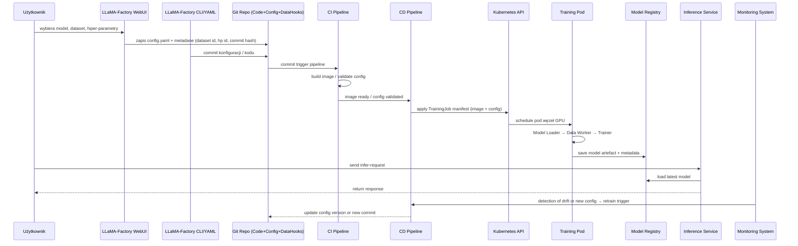
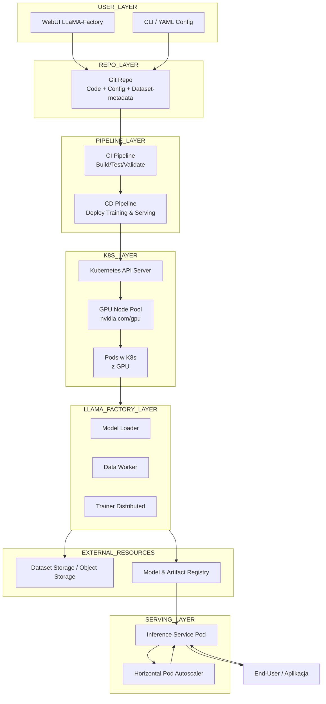
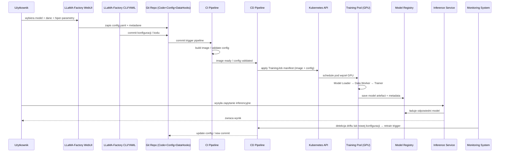

Dobrze — oto **rozszerzenie poprzedniego dokumentu** z wyjaśnieniem dokładnie **jak LLaMA‑Factory działa**, w tym jakie zdarzenia i triggery występują, kiedy interakcja użytkownika wywołuje procesy, oraz jak to się wpisuje w architekturę, którą już mamy. Możesz to włączyć do dokumentacji projektowej.

---

## 🔄 Jak działa cały workflow – „co, kiedy i jak” w LLaMA-Factory

### 1. Użytkownik → WebUI / CLI / YAML

* Użytkownik końcowy lub analityk wchodzi w interfejs WebUI LLaMA-Factory (np. uruchamiając `llamafactory-cli webui`). ([docs.swanlab.cn][1])
* Alternatywnie DevOps/Data Scientist przygotowuje plik YAML/JSON (konfigurację treningu) lub używa CLI: np. `llamafactory-cli train --config train_config.yaml`. ([docs.swanlab.cn][1])
* W WebUI użytkownik wybiera: model bazowy, metodę fine-tuningu (LoRA/QLoRA), dataset, hiper-parametry, miejsce zapisu outputu. ([datacamp.com][2])
* Po kliknięciu „Start” w UI lub po wywołaniu CLI następuje zapis konfiguracji (model, dataset, hiper-parametry) jako pliku YAML/JSON w repozytorium (Git). To działa jako trigger dla dalszych kroków.

### 2. Trigger w repozytorium → CI/CD

* Zapis (commit) pliku konfiguracji lub kodu w repozytorium Git wyzwala pipeline CI (Continuous Integration). Plik konfiguracji może zawierać metadane (np. wersję datasetu, hash komitu, hiper-parametry).
* CI pipeline wykonuje: budowę obrazu Docker (jeśli przewidziane), walidację pliku YAML (czy wszystkie wymagane pola są wypełnione), testy (np. czy dataset istnieje, czy model bazowy jest dostępny).
* Po pomyślnym CI, pipeline CD (Continuous Delivery) uruchamia manifesty K8s lub inne mechanizmy deployu — np. Job treningowy albo Deployment dla serwisu inferencji.

### 3. Deployment w Kubernetes + start treningu

* Manifest K8s (Job) definiuje obraz kontenera (z LLaMA-Factory i zależnościami), zasoby GPU (`nvidia.com/gpu: "n"`), woluminy dla danych i outputu, zmienne środowiskowe.
* Po wykonaniu `kubectl apply` lub przez CD pipeline K8s API przydziela podowi węzeł z GPU.
* Kontener startuje: wewnątrz działa LLaMA-Factory – komponenty Model Loader, Data Worker, Trainer są uruchamiane zgodnie z konfiguracją.
* Model Loader ładuje bazowy model i adaptery; Data Worker przygotowuje dane; Trainer rozpoczyna fine-tuningu lub trening rozproszony (multi-GPU/multi-node) - LLaMA-Factory wspiera to. ([Llama Factory][3])
* W trakcie działania: logi, metryki (loss, accuracy, GPU usage) są emitowane – użytkownik/DevOps może monitorować stan.
* Po zakończeniu treningu artefakt modelu (checkpointy, adaptery) zostaje zapisany w output-dir lub wysłany do Model Registry (lub zewnętrznego magazynu modeli) wraz z metadanymi (dataset wersja, konfiguracja, commit hash).

### 4. Serwis inferencji

* Po treningu lub niezależnie po wybraniu modelu można uruchomić serwis inferencyjny (np. `llamafactory-cli api config.yaml`) lub K8s Deployment + Service. ([datacamp.com][2])
* Serwis ładuje odpowiedni model (na podstawie metadanych/artefaktu) z model registry lub lokalnego katalogu.
* Tę warstwę można autoskalować – np. Horizontal Pod Autoscaler (HPA) reaguje na zapytania, ruch, latencję i skaluje liczbę replik.
* Użytkownik końcowy (aplikacja) wysyła zapytanie do endpointu API, model odpowiada.

### 5. Monitoring, retraining i cykl MLOps

* Monitoring zbiera metryki: wydajność modelu, błędy, drift danych (czy model przestał spełniać oczekiwania).
* Jeśli warunki spełnione (np. nowy dataset, zmiana domeny, wykryty drift, nowy commit konfiguracji), trigger retrain jest aktywowany – czyli proces wraca do kroku 1 lub 3: nowa konfiguracja → CI/CD → trening → serwis.
* Cały cykl zapewnia śledzalność: konfiguracja (model/dane/hiperparametry) jest zapisana w repozytorium, kod jest wersjonowany, artefakty modelu zachowane – co umożliwia odtworzenie eksperymentu.

---

## 📊 Diagram ze szczegółowymi triggerami i przepływami

---

Jeśli chcesz — mogę wygenerować **kompletny plik Markdown** zawierający cały dokument + diagramy + krok po kroku trigger workflow + **szablon YAML pliku konfiguracji** z miejscami na metadane commit hash, dataset version itp.

[1]: https://docs.swanlab.cn/en/guide_cloud/integration/integration-llama-factory.html?utm_source=chatgpt.com "LLaMA Factory | SwanLab Docs"
[2]: https://www.datacamp.com/de/tutorial/llama-factory-web-ui-guide-fine-tuning-llms?utm_source=chatgpt.com "LlaMA-Factory WebUI Beginner's Guide: Fine-Tuning LLMs"
[3]: https://llamafactory.readthedocs.io/en/latest/?utm_source=chatgpt.com "Welcome to LLaMA Factory!"

---

### Diagram A: Struktura komponentów na Kubernetes

---

### Diagram B: Przepływ operacyjny (workflow)

