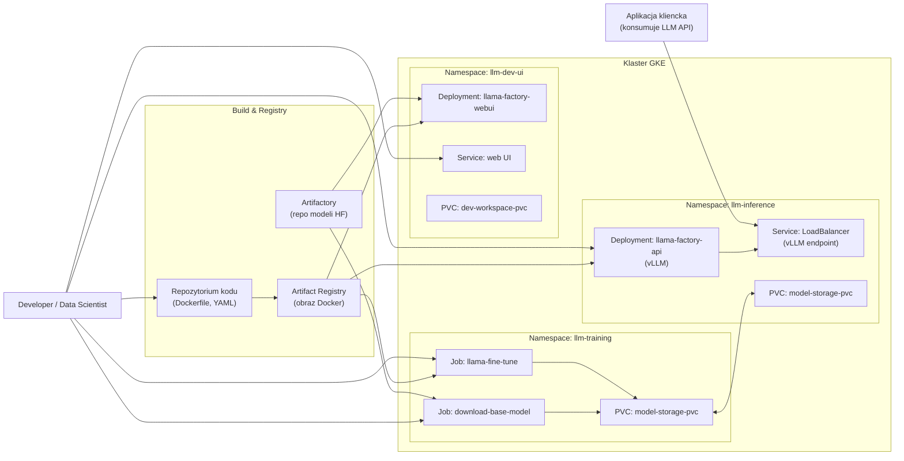
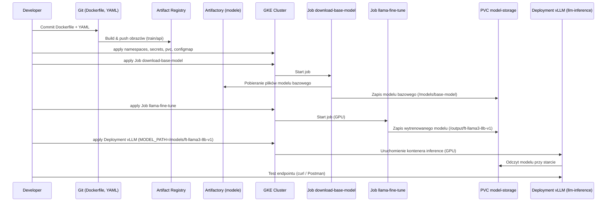

## 1. Założenia wspólne

* **Platforma:** Google Kubernetes Engine (GKE) z węzłami GPU.
* **System bazowy w kontenerach:** `debian:12`.
* **Python:** 3.11 (pakiet `python3.11` z Debian 12).
* **GPU:** nody z GPU NVIDIA, skonfigurowane z:

  * sterownikami NVIDIA,
  * `nvidia-container-toolkit`,
  * pluginem K8s tak, aby zasób był widoczny jako `nvidia.com/gpu`.
* **Rejestr obrazów:** Artifact Registry / GCR, np. `eu.gcr.io/<PROJECT>`.
* **Repo modeli:**
  **Wyłącznie Artifactory** (mirror / repo HF) – modele bazowe i wytrenowane są przechowywane w Artifactory; w K8s używane są pliki pobrane z Artifactory na PVC (brak bezpośrednich połączeń do huggingface.co).
* **Narzędzia:**

  * do treningu: **LLaMA-Factory**,
  * do inference: **vLLM** (OpenAI-style API),
  * automatyzacja (opcjonalnie później): **Argo Workflows**, **Argo CD**, dowolny Model Registry.

---

## 2. Obrazy Docker i push do Artifact Registry

### 2.1. Dockerfile treningowy – `llama-factory-train`

```dockerfile
FROM debian:12

ENV DEBIAN_FRONTEND=noninteractive

# 1. System + Python 3.11 + narzędzia build
RUN apt-get update && apt-get install -y \
    python3.11 python3.11-venv python3-pip \
    build-essential git curl wget ca-certificates \
    && apt-get clean && rm -rf /var/lib/apt/lists/*

# Linki dla "python" i "pip"
RUN ln -sf /usr/bin/python3.11 /usr/bin/python && \
    ln -sf /usr/bin/pip3 /usr/bin/pip

# 2. PyTorch z CUDA 11.8 + Transformers + Datasets
RUN pip install --no-cache-dir --upgrade pip && \
    pip install --no-cache-dir \
      torch==2.2.0 torchvision==0.17.0 torchaudio==2.2.0 \
      --extra-index-url https://download.pytorch.org/whl/cu118 && \
    pip install --no-cache-dir \
      transformers==4.37.0 datasets==2.17.0

# 3. LLaMA-Factory (+ metrics)
RUN pip install --no-cache-dir "llamafactory[torch,metrics]==0.9.3"

# (opcjonalnie, jeśli wymagane)
# RUN pip install --no-cache-dir bitsandbytes==0.43.0 deepspeed==0.14.0

WORKDIR /app

ENTRYPOINT ["/bin/bash"]
```

---

### 2.2. Dockerfile inferencyjny – `llama-factory-api` (vLLM)

```dockerfile
FROM debian:12

ENV DEBIAN_FRONTEND=noninteractive

RUN apt-get update && apt-get install -y \
    python3.11 python3-pip \
    build-essential git curl ca-certificates \
    && apt-get clean && rm -rf /var/lib/apt/lists/*

RUN ln -sf /usr/bin/python3.11 /usr/bin/python && \
    ln -sf /usr/bin/pip3 /usr/bin/pip

# PyTorch CUDA + Transformers + vLLM + LLaMA-Factory
RUN pip install --no-cache-dir --upgrade pip && \
    pip install --no-cache-dir \
      torch==2.2.0 torchvision==0.17.0 \
      --extra-index-url https://download.pytorch.org/whl/cu118 && \
    pip install --no-cache-dir \
      transformers==4.37.0 \
      vllm==0.4.0 \
      "llamafactory[torch]==0.9.3"

WORKDIR /app

EXPOSE 8000

# Konfiguracja inferencji będzie montowana jako /app/config/inference.yaml
CMD ["llamafactory-cli", "api", "/app/config/inference.yaml", "infer_backend=vllm", "API_PORT=8000"]
```

---

### 2.3. Budowa i push obrazów do Artifact Registry

Zakłada się, że Artifact Registry jest skonfigurowany w projekcie `PROJECT` i znajduje się w regionie `eu`.
Przykładowe tagi:

* `eu.gcr.io/<PROJECT>/llama-factory-train:latest`
* `eu.gcr.io/<PROJECT>/llama-factory-api:latest`

#### Autoryzacja (przykład z `gcloud`)

```bash
gcloud auth configure-docker eu.gcr.io
```

#### Budowa obrazów

```bash
# katalog zawierający Dockerfile.train i Dockerfile.api

docker build -f Dockerfile.train -t eu.gcr.io/<PROJECT>/llama-factory-train:latest .

docker build -f Dockerfile.api   -t eu.gcr.io/<PROJECT>/llama-factory-api:latest .
```

#### Push do rejestru

```bash
docker push eu.gcr.io/<PROJECT>/llama-factory-train:latest
docker push eu.gcr.io/<PROJECT>/llama-factory-api:latest
```

Po tym kroku obrazy są dostępne dla klastra GKE (zakładając, że klaster działa w tym samym projekcie i ma standardową integrację z Artifact Registry/GCR).

---

## 3. Zasoby Kubernetes (GKE)

### 3.1. Namespace’y

```yaml
apiVersion: v1
kind: Namespace
metadata:
  name: llm-training
---
apiVersion: v1
kind: Namespace
metadata:
  name: llm-inference
---
apiVersion: v1
kind: Namespace
metadata:
  name: llm-dev-ui
```

---

### 3.2. Secret’y – Artifactory

Opis zakłada, że **cały ruch do repo modeli idzie przez Artifactory**, zarówno dla `curl`, jak i dla ewentualnych narzędzi Pythona.

Przykładowy sekret z danymi do Artifactory (dla `llm-training`):

```yaml
apiVersion: v1
kind: Secret
metadata:
  name: artifactory-secret
  namespace: llm-training
type: Opaque
stringData:
  ARTIFACTORY_BASE_URL: "https://artifactory.example.com"  # root Artifactory
  ARTIFACTORY_MODELS_REPO: "ai-models-local"               # repo z modelami HF
  ARTIFACTORY_USER: "user"
  ARTIFACTORY_PASSWORD: "pass"
```

Analogiczne sekrety można utworzyć w `llm-inference` i `llm-dev-ui`, jeśli będą tam wymagane (np. do pobierania modeli z UI).

---

### 3.3. PVC na modele

```yaml
apiVersion: v1
kind: PersistentVolumeClaim
metadata:
  name: model-storage-pvc
  namespace: llm-training
spec:
  accessModes:
    - ReadWriteOnce
  resources:
    requests:
      storage: 50Gi
  storageClassName: standard
---
apiVersion: v1
kind: PersistentVolumeClaim
metadata:
  name: model-storage-pvc
  namespace: llm-inference
spec:
  accessModes:
    - ReadWriteOnce
  resources:
    requests:
      storage: 50Gi
  storageClassName: standard
```

---

### 3.4. ConfigMap z konfiguracją treningu

```yaml
apiVersion: v1
kind: ConfigMap
metadata:
  name: llama-train-config
  namespace: llm-training
data:
  train_config.yaml: |
    model_name_or_path: /models/base-model
    stage: sft
    finetuning_type: lora
    dataset: my_corp_dataset
    template: llama3
    output_dir: /output/ft-llama3-8b-v1
    per_device_train_batch_size: 1
    num_train_epochs: 3
    learning_rate: 1e-4
```

---

## 4. Scenariusz 1 – trenowanie modelu w Kubernetes (bez Argo)

### 4.1. Job: pobranie modelu bazowego z Artifactory

```yaml
apiVersion: batch/v1
kind: Job
metadata:
  name: download-base-model
  namespace: llm-training
spec:
  template:
    spec:
      containers:
      - name: downloader
        image: curlimages/curl:8.6.0
        command: ["/bin/sh", "-c"]
        args:
          - |
            echo "Pobieranie modelu bazowego z Artifactory...";
            mkdir -p /models/base-model;

            BASE_URL="${ARTIFACTORY_BASE_URL}/${ARTIFACTORY_MODELS_REPO}/meta-llama/Meta-Llama-3-8B"

            curl -u "${ARTIFACTORY_USER}:${ARTIFACTORY_PASSWORD}" -L \
                 "${BASE_URL}/pytorch_model.bin" -o /models/base-model/pytorch_model.bin;

            curl -u "${ARTIFACTORY_USER}:${ARTIFACTORY_PASSWORD}" -L \
                 "${BASE_URL}/config.json" -o /models/base-model/config.json;

            curl -u "${ARTIFACTORY_USER}:${ARTIFACTORY_PASSWORD}" -L \
                 "${BASE_URL}/tokenizer.json" -o /models/base-model/tokenizer.json;

            echo "Model bazowy pobrany do /models/base-model.";
        env:
        - name: ARTIFACTORY_BASE_URL
          valueFrom:
            secretKeyRef:
              name: artifactory-secret
              key: ARTIFACTORY_BASE_URL
        - name: ARTIFACTORY_MODELS_REPO
          valueFrom:
            secretKeyRef:
              name: artifactory-secret
              key: ARTIFACTORY_MODELS_REPO
        - name: ARTIFACTORY_USER
          valueFrom:
            secretKeyRef:
              name: artifactory-secret
              key: ARTIFACTORY_USER
        - name: ARTIFACTORY_PASSWORD
          valueFrom:
            secretKeyRef:
              name: artifactory-secret
              key: ARTIFACTORY_PASSWORD
        volumeMounts:
        - name: model-storage
          mountPath: /models
      restartPolicy: OnFailure
      volumes:
      - name: model-storage
        persistentVolumeClaim:
          claimName: model-storage-pvc
```

Uruchomienie i obserwacja:

```bash
kubectl apply -f job-download-base-model.yaml
kubectl -n llm-training logs -f job/download-base-model
```

---

### 4.2. Job: trening LLaMA-Factory (z modelu z Artifactory)

```yaml
apiVersion: batch/v1
kind: Job
metadata:
  name: llama-fine-tune
  namespace: llm-training
spec:
  backoffLimit: 0
  template:
    spec:
      containers:
      - name: trainer
        image: eu.gcr.io/<PROJECT>/llama-factory-train:latest
        imagePullPolicy: IfNotPresent
        command: ["/bin/bash", "-c"]
        args: |
          echo "Start fine-tune...";
          cp /config/train_config.yaml /app/train_config.yaml;
          # Zakłada się, że model bazowy jest już w /models/base-model
          llamafactory-cli train /app/train_config.yaml;
          echo "Fine-tune finished.";
        volumeMounts:
        - name: model-storage
          mountPath: /models
        - name: output-storage
          mountPath: /output
        - name: train-config
          mountPath: /config
        resources:
          limits:
            nvidia.com/gpu: 1
          requests:
            nvidia.com/gpu: 1
      restartPolicy: OnFailure
      volumes:
      - name: model-storage
        persistentVolumeClaim:
          claimName: model-storage-pvc
      - name: output-storage
        persistentVolumeClaim:
          claimName: model-storage-pvc
      - name: train-config
        configMap:
          name: llama-train-config
```

Uruchomienie:

```bash
kubectl apply -f job-llama-fine-tune.yaml
kubectl -n llm-training logs -f job/llama-fine-tune
```

Po zakończeniu treningu w PVC (pod `/output/ft-llama3-8b-v1`) znajduje się wytrenowany model (np. w formacie HF).

---

## 5. Scenariusz 2 – inference jako zewnętrzny endpoint vLLM

### 5.1. Deployment + Service (LoadBalancer)

```yaml
apiVersion: apps/v1
kind: Deployment
metadata:
  name: llama-factory-inference
  namespace: llm-inference
  labels:
    app: llama-infer
spec:
  replicas: 1
  selector:
    matchLabels:
      app: llama-infer
  template:
    metadata:
      labels:
        app: llama-infer
    spec:
      containers:
      - name: inference
        image: eu.gcr.io/<PROJECT>/llama-factory-api:latest
        imagePullPolicy: IfNotPresent
        ports:
          - containerPort: 8000
        env:
          - name: MODEL_PATH
            value: "/models/ft-llama3-8b-v1"
        resources:
          limits:
            nvidia.com/gpu: 1
          requests:
            nvidia.com/gpu: 1
        volumeMounts:
          - name: model-storage
            mountPath: /models
      volumes:
        - name: model-storage
          persistentVolumeClaim:
            claimName: model-storage-pvc
---
apiVersion: v1
kind: Service
metadata:
  name: llama-factory-inference
  namespace: llm-inference
spec:
  type: LoadBalancer
  selector:
    app: llama-infer
  ports:
    - name: http
      port: 80
      targetPort: 8000
```

Po wdrożeniu:

```bash
kubectl apply -f inference-deployment.yaml
kubectl -n llm-inference get svc/llama-factory-inference
```

Odczytany zewnętrzny adres IP **pełni rolę endpointu vLLM**.

Przykładowe wywołanie (OpenAI-style):

```bash
curl http://<EXTERNAL-IP>/v1/completions \
  -H "Content-Type: application/json" \
  -d '{
        "model": "ft-llama3-8b-v1",
        "prompt": "Hello, how are you?",
        "max_tokens": 50
      }'
```

---

### 5.2. (Opcjonalnie) HPA dla inferencji

```yaml
apiVersion: autoscaling/v2
kind: HorizontalPodAutoscaler
metadata:
  name: llama-inference-hpa
  namespace: llm-inference
spec:
  scaleTargetRef:
    apiVersion: apps/v1
    kind: Deployment
    name: llama-factory-inference
  minReplicas: 1
  maxReplicas: 4
  metrics:
    - type: Resource
      resource:
        name: cpu
        target:
          type: Utilization
          averageUtilization: 60
```

---

## 6. UI LLaMA-Factory (dev workspace)

### 6.1. PVC dla UI

```yaml
apiVersion: v1
kind: PersistentVolumeClaim
metadata:
  name: dev-workspace-pvc
  namespace: llm-dev-ui
spec:
  accessModes:
    - ReadWriteOnce
  resources:
    requests:
      storage: 50Gi
  storageClassName: standard
```

### 6.2. Secret dla UI (Artifactory – jeśli UI ma pobierać modele)

```yaml
apiVersion: v1
kind: Secret
metadata:
  name: artifactory-secret
  namespace: llm-dev-ui
type: Opaque
stringData:
  ARTIFACTORY_BASE_URL: "https://artifactory.example.com"
  ARTIFACTORY_MODELS_REPO: "ai-models-local"
  ARTIFACTORY_USER: "user"
  ARTIFACTORY_PASSWORD: "pass"
```

### 6.3. Deployment UI

```yaml
apiVersion: apps/v1
kind: Deployment
metadata:
  name: llama-factory-webui
  namespace: llm-dev-ui
spec:
  replicas: 1
  selector:
    matchLabels:
      app: llama-factory-webui
  template:
    metadata:
      labels:
        app: llama-factory-webui
    spec:
      containers:
      - name: webui
        image: eu.gcr.io/<PROJECT>/llama-factory-train:latest
        imagePullPolicy: IfNotPresent
        command: ["bash", "-lc"]
        args: >
          mkdir -p /workspace/configs /workspace/logs /workspace/outputs &&
          llamafactory-cli webui --host 0.0.0.0 --port 7860
        env:
          - name: ARTIFACTORY_BASE_URL
            valueFrom:
              secretKeyRef:
                name: artifactory-secret
                key: ARTIFACTORY_BASE_URL
          - name: ARTIFACTORY_MODELS_REPO
            valueFrom:
              secretKeyRef:
                name: artifactory-secret
                key: ARTIFACTORY_MODELS_REPO
          - name: ARTIFACTORY_USER
            valueFrom:
              secretKeyRef:
                name: artifactory-secret
                key: ARTIFACTORY_USER
          - name: ARTIFACTORY_PASSWORD
            valueFrom:
              secretKeyRef:
                name: artifactory-secret
                key: ARTIFACTORY_PASSWORD
        ports:
          - containerPort: 7860
        volumeMounts:
          - name: workspace
            mountPath: /workspace
        resources:
          requests:
            cpu: "2"
            memory: "8Gi"
          limits:
            cpu: "4"
            memory: "16Gi"
            # opcjonalnie GPU:
            # nvidia.com/gpu: 1
      volumes:
      - name: workspace
        persistentVolumeClaim:
          claimName: dev-workspace-pvc
```

### 6.4. Service do UI

```yaml
apiVersion: v1
kind: Service
metadata:
  name: llama-factory-webui
  namespace: llm-dev-ui
spec:
  type: LoadBalancer
  selector:
    app: llama-factory-webui
  ports:
    - name: http
      port: 80
      targetPort: 7860
```

### 6.5. Konwencja katalogów w UI

W podzie UI montowany jest PVC pod `/workspace` z następującą strukturą:

* `/workspace/configs` – konfiguracje eksperymentów (YAML z UI),
* `/workspace/logs` – logi z treningów wywołanych z UI,
* `/workspace/outputs` – wyjścia modeli (checkpointy, adaptery, modele HF).

---

## 7. Diagramy (do wklejenia jako blok `mermaid` w Confluence)

### 7.1. Diagram podstawowej architektury



---

### 7.2. Diagram przepływu: build → trening → inference


