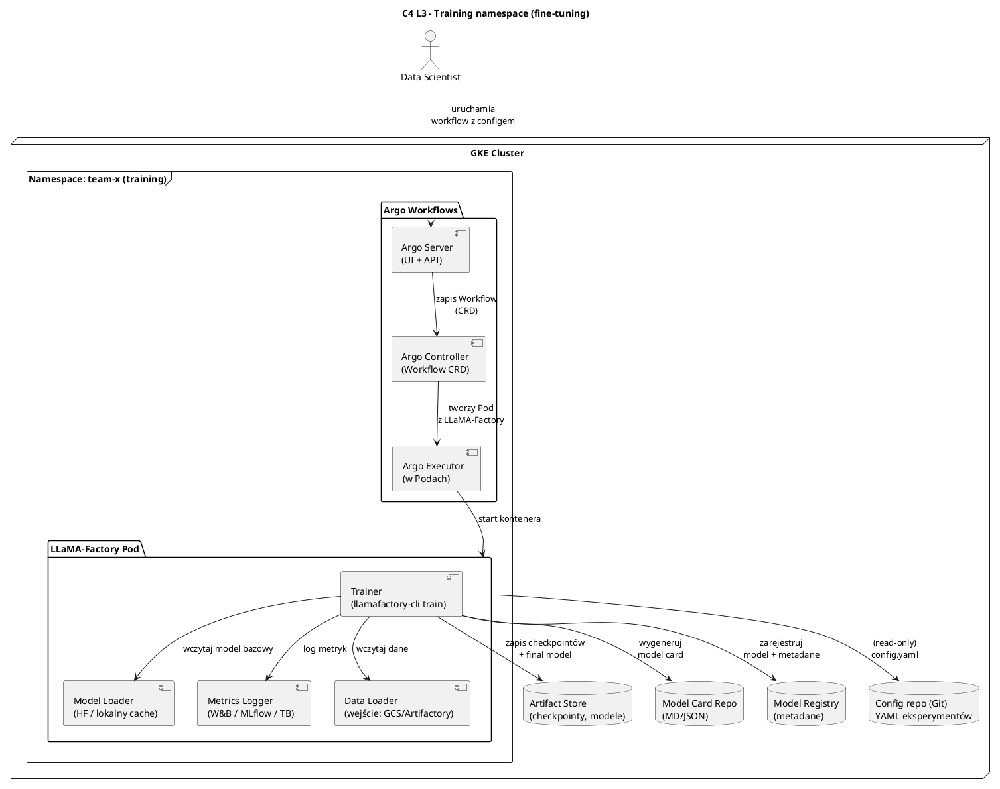
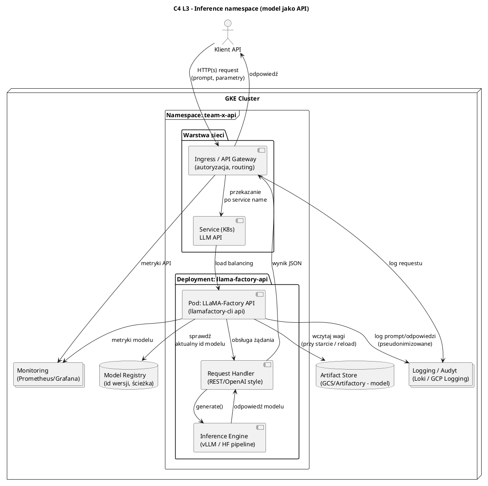
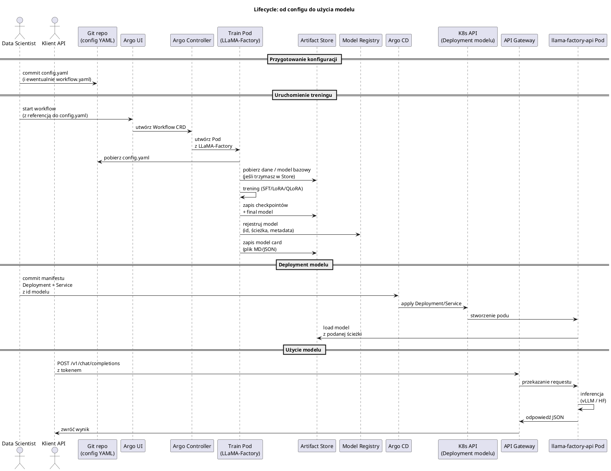

Dobra, to **dorzucam wszystko, czego „brakowało”** – bez zewnętrznych include, tak żeby Ci to działało w każdym PlantUML / mermaid offline.

Poniżej masz:

1. C4 **Level 3** – komponenty w *training namespace*.
2. C4 **Level 3** – komponenty w *inference namespace*.
3. **Sequence diagram** – cały lifecycle: od YAML-a do requestu na API.
4. **Minimalny Helm chart** dla `llama-factory-api` (inference + HPA).
5. Sugestia **Model Registry / Model Card** pod AI Act (pola, które warto mieć).

---

## 1. C4 L3 – Training namespace (PlantUML, offline)



---

## 2. C4 L3 – Inference namespace (PlantUML, offline)



---

## 3. Sequence diagram – pełen lifecycle (PlantUML)

Od YAML-a → trening → rejestr modelu → deployment → request klienta.



---

## 4. Minimalny Helm chart – `llama-factory-api`

To jest **szkielet**, który możesz wkleić do repo i dopieścić pod swoje potrzeby / wartości.

### 4.1. `Chart.yaml`

```yaml
apiVersion: v2
name: llama-factory-api
description: Minimalny chart do uruchomienia LLaMA-Factory jako API (inference)
type: application
version: 0.1.0
appVersion: "0.1.0"
```

### 4.2. `values.yaml` (przykład)

```yaml
image:
  repository: europe-docker.pkg.dev/YOUR-PROJECT/llm/llama-factory
  tag: "api-0.1.0"
  pullPolicy: IfNotPresent

replicaCount: 1

resources:
  limits:
    cpu: "4"
    memory: "16Gi"
    nvidia.com/gpu: 1
  requests:
    cpu: "2"
    memory: "8Gi"
    nvidia.com/gpu: 1

service:
  type: ClusterIP
  port: 8000

model:
  id: "team-x/llm-qa-v1"
  artifactPath: "gs://my-bucket/models/team-x/llm-qa-v1"
  # lub: "s3://..." / "artifactory://..."

env:
  # endpoint Artifactory / HF proxy
  HF_ENDPOINT: ""
  HF_TOKEN_SECRET_NAME: "hf-token"
  HF_TOKEN_SECRET_KEY: "token"

ingress:
  enabled: false
  className: ""
  hosts:
    - host: llama-api.example.com
      paths:
        - path: /
          pathType: Prefix
  tls: []
```

### 4.3. `templates/deployment.yaml`

```yaml
apiVersion: apps/v1
kind: Deployment
metadata:
  name: {{ include "llama-factory-api.fullname" . }}
  labels:
    app.kubernetes.io/name: {{ include "llama-factory-api.name" . }}
    app.kubernetes.io/instance: {{ .Release.Name }}
spec:
  replicas: {{ .Values.replicaCount }}
  selector:
    matchLabels:
      app.kubernetes.io/name: {{ include "llama-factory-api.name" . }}
      app.kubernetes.io/instance: {{ .Release.Name }}
  template:
    metadata:
      labels:
        app.kubernetes.io/name: {{ include "llama-factory-api.name" . }}
        app.kubernetes.io/instance: {{ .Release.Name }}
    spec:
      containers:
        - name: api
          image: "{{ .Values.image.repository }}:{{ .Values.image.tag }}"
          imagePullPolicy: {{ .Values.image.pullPolicy }}
          args:
            - "llamafactory-cli"
            - "api"
            - "--model-id={{ .Values.model.id }}"
            - "--model-path={{ .Values.model.artifactPath }}"
            - "--host=0.0.0.0"
            - "--port={{ .Values.service.port }}"
          env:
            - name: HF_ENDPOINT
              value: "{{ .Values.env.HF_ENDPOINT }}"
            - name: HF_TOKEN
              valueFrom:
                secretKeyRef:
                  name: {{ .Values.env.HF_TOKEN_SECRET_NAME }}
                  key: {{ .Values.env.HF_TOKEN_SECRET_KEY }}
          ports:
            - containerPort: {{ .Values.service.port }}
          resources:
{{ toYaml .Values.resources | indent 12 }}
```

### 4.4. `templates/service.yaml`

```yaml
apiVersion: v1
kind: Service
metadata:
  name: {{ include "llama-factory-api.fullname" . }}
spec:
  type: {{ .Values.service.type }}
  selector:
    app.kubernetes.io/name: {{ include "llama-factory-api.name" . }}
    app.kubernetes.io/instance: {{ .Release.Name }}
  ports:
    - name: http
      port: {{ .Values.service.port }}
      targetPort: {{ .Values.service.port }}
```

### 4.5. `templates/hpa.yaml` – auto-scaling inference

```yaml
apiVersion: autoscaling/v2
kind: HorizontalPodAutoscaler
metadata:
  name: {{ include "llama-factory-api.fullname" . }}
spec:
  scaleTargetRef:
    apiVersion: apps/v1
    kind: Deployment
    name: {{ include "llama-factory-api.fullname" . }}
  minReplicas: 1
  maxReplicas: 5
  metrics:
    - type: Resource
      resource:
        name: cpu
        target:
          type: Utilization
          averageUtilization: 70
```

> GPU HPA jest trudniejszy (brak standardowych metryk), ale możesz dodać metryki custom przez Prometheus + Prometheus Adapter.

---

## 5. Model Registry & Model Card – pola, które warto mieć (AI Act)

### 5.1. Model Registry – przykładowy „schemat”

Myśl o tym jak o tabeli SQL / dokumencie NoSQL:

* `model_id` – globalny identyfikator (np. `team-x.llm-qa.v1`)
* `version` – semver / hash (`1.0.0`, `git_sha`)
* `base_model` – np. `meta-llama/Llama-3-8B`
* `tenant` – nazwa zespołu / klienta
* `risk_class` – `HIGH_RISK` / `GENERAL_PURPOSE` / inne
* `status` – `TRAINED`, `VALIDATED`, `DEPLOYED`, `DEPRECATED`
* `artifact_path` – ścieżka w GCS/Artifactory do wag
* `config_path` – ścieżka do config.yaml w Git
* `data_id` – identyfikator zbioru danych (link do repo datasetu)
* `metrics` – np. JSON z kluczowymi metrykami (accuracy, BLEU, itd.)
* `owner` – osoba/rola odpowiedzialna
* `created_at`, `updated_at`
* `ai_act_notes` – specjalne pole (np. odnośnik do decyzji oceny ryzyka, procedury zgodności)

### 5.2. Model Card – sekcje (zgodnie z AI Act)

W praktyce możesz zrobić szablon Markdown:

1. **Identyfikacja modelu**

   * nazwa, wersja, model_id, właściciel.
2. **Cel i zastosowanie**

   * do czego model jest przeznaczony, do czego **nie** jest.
3. **Klasa ryzyka (AI Act)**

   * np. high-risk, general-purpose; link do analizy ryzyka.
4. **Dane treningowe**

   * źródła, typy danych, preprocessing, potencjalne biasy.
5. **Metody treningu**

   * baza (np. LLaMA-3), technika (SFT, LoRA, QLoRA), hiperparametry (skrót).
6. **Wyniki i metryki**

   * metryki na zbiorach walidacyjnych/testowych, porównanie z baseline.
7. **Ograniczenia**

   * znane problemy, scenariusze, gdzie wynik może być fałszywy/niebezpieczny.
8. **Kontrola i nadzór**

   * jak monitorowany jest model, jakie są procedury wycofania/rollback.
9. **Logowanie / audyt**

   * jakie logi są zbierane, na jak długo, kto ma dostęp.
10. **Kontakt / odpowiedzialność**

    * do kogo zgłaszać incydenty.

---

Jeśli chcesz, następnym krokiem mogę:

* przerobić któryś z tych diagramów/Helmów **pod konkretny Twój naming / namespace / registry**,
* albo dorzucić **mermaid sequence diagram** (jeśli wolisz mieć pełny komplet w jednym stylu).
