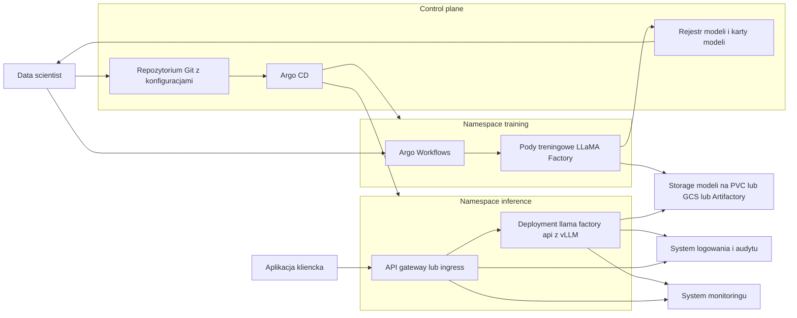
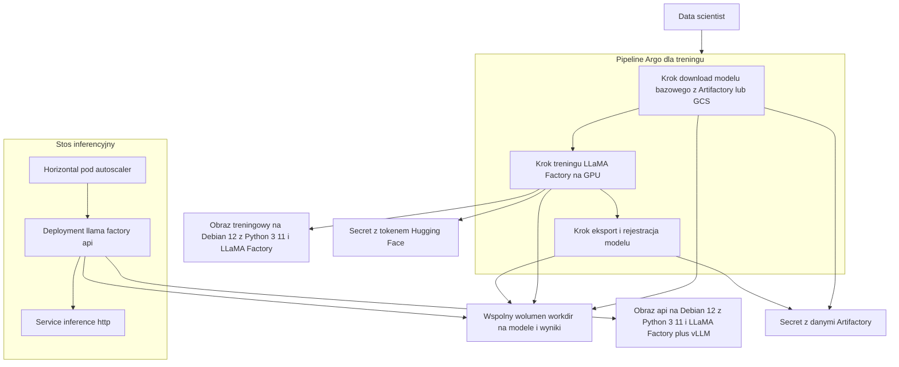
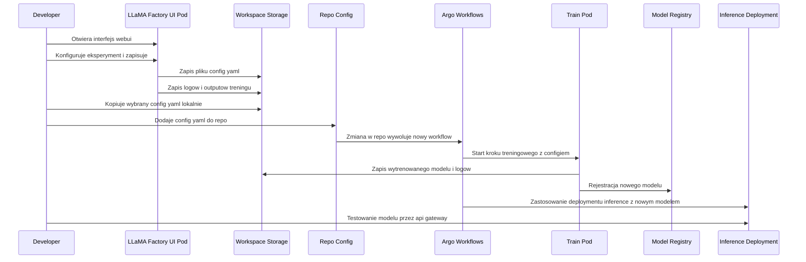

OK, to zlepmy to wszystko w jeden **spójny, finalny pakiet**:
– obrazy na **Debian 12 + Python 3.11.2**,
– **Argo Workflow** do E2E pipeline’u,
– **Deployment** inferencji na vLLM,
– spójny opis i diagram.

---

# 0. Założenia wspólne

Przyjmijmy:

* Bazowy OS: **Debian 12**
* Python: **3.11.2** (w Debianie 12 pakiet `python3.11` jest 3.11.2 → OK z PyTorch/Transformers/LLaMA‑Factory).
* GPU: nody K8s z **NVIDIA + nvidia‑container‑toolkit** (GPU widoczne jako `nvidia.com/gpu`).
* Registry: np. `eu.gcr.io/<PROJECT>` / Artifact Registry.
* Repo modeli:

  * bazowe: HF **przez Artifactory** (proxy) albo bezpośrednio,
  * wytrenowane: Artifactory / GCS.
* Narzędzia: **LLaMA‑Factory**, **vLLM**, **Argo Workflows**, (opcjonalnie MLflow).

---

# 1. Obrazy Docker – Debian 12 + Python 3.11.2

## 1.1. Obraz treningowy – `llama-factory-train`

**Plik: `Dockerfile.train`**

```dockerfile
FROM debian:12

ENV DEBIAN_FRONTEND=noninteractive

# 1) System + Python 3.11.2 + narzędzia buildowe
RUN apt-get update && apt-get install -y \
    python3.11 python3.11-venv python3-pip \
    build-essential git curl wget ca-certificates \
    && apt-get clean && rm -rf /var/lib/apt/lists/*

# Linki, żeby "python" i "pip" były jednoznaczne
RUN ln -sf /usr/bin/python3.11 /usr/bin/python && \
    ln -sf /usr/bin/pip3 /usr/bin/pip

# 2) Zależności Python – CUDA przez koła PyTorch (cu118)
#    Wymaga sterowników NVIDIA na hoście (nvidia-container-toolkit).
RUN pip install --no-cache-dir --upgrade pip && \
    pip install --no-cache-dir \
      "torch==2.2.0" "torchvision==0.17.0" "torchaudio==2.2.0" \
      --extra-index-url https://download.pytorch.org/whl/cu118 && \
    pip install --no-cache-dir \
      "transformers==4.37.0" "datasets==2.17.0"

# 3) LLaMA-Factory (+ extras do trenowania)
RUN pip install --no-cache-dir "llamafactory[torch,metrics]==0.9.3"

# (opcjonalnie)
# RUN pip install --no-cache-dir "bitsandbytes==0.43.0" "deepspeed==0.14.0"

WORKDIR /app

# Zakładamy, że configi będą montowane z ConfigMap / PV
# Domyślnie wchodzimy w bash; Argo/K8s poda konkretną komendę
ENTRYPOINT ["/bin/bash"]
```

> ✔ Debian 12, ✔ Python 3.11.2, ✔ PyTorch z CUDA, ✔ Transformers, ✔ LLaMA‑Factory.

---

## 1.2. Obraz inferencyjny – `llama-factory-api` (vLLM)

**Plik: `Dockerfile.api`**

```dockerfile
FROM debian:12

ENV DEBIAN_FRONTEND=noninteractive

RUN apt-get update && apt-get install -y \
    python3.11 python3-pip \
    build-essential git curl ca-certificates \
    && apt-get clean && rm -rf /var/lib/apt/lists/*

RUN ln -sf /usr/bin/python3.11 /usr/bin/python && \
    ln -sf /usr/bin/pip3 /usr/bin/pip

# PyTorch z CUDA + Transformers + vLLM + LLaMA-Factory
RUN pip install --no-cache-dir --upgrade pip && \
    pip install --no-cache-dir \
      "torch==2.2.0" "torchvision==0.17.0" \
      --extra-index-url https://download.pytorch.org/whl/cu118 && \
    pip install --no-cache-dir \
      "transformers==4.37.0" \
      "vllm==0.4.0" \
      "llamafactory[torch]==0.9.3"

WORKDIR /app

# Konfiguracja inferencji będzie montowana jako plik
# /app/config/inference.yaml
EXPOSE 8000

CMD ["llamafactory-cli", "api", "/app/config/inference.yaml", "infer_backend=vllm", "API_PORT=8000"]
```

> Ten obraz służy wyłącznie do inferencji (OpenAI‑style API na vLLM).

---

# 2. Kubernetes: namespace, Secret, PVC

## 2.1. Namespace’y

```yaml
apiVersion: v1
kind: Namespace
metadata:
  name: llm-training
---
apiVersion: v1
kind: Namespace
metadata:
  name: llm-inference
---
apiVersion: v1
kind: Namespace
metadata:
  name: llm-argo
```

## 2.2. Sekrety (HF token + Artifactory)

```yaml
apiVersion: v1
kind: Secret
metadata:
  name: hf-secret
  namespace: llm-training
type: Opaque
stringData:
  HF_TOKEN: "hf_xxxxx"

---
apiVersion: v1
kind: Secret
metadata:
  name: artifactory-secret
  namespace: llm-training
type: Opaque
stringData:
  ARTIFACTORY_URL: "https://artifactory.example.com/hf-proxy"
  ARTIFACTORY_USER: "user"
  ARTIFACTORY_PASSWORD: "pass"
```

Pod inference możesz użyć tych samych sekretów (zduplikować w `llm-inference` albo użyć Secretów w innym namespace przez narzędzia typu ExternalSecrets).

## 2.3. PVC na model

Minimalny przykład – 50Gi na wytrenowane modele:

```yaml
apiVersion: v1
kind: PersistentVolumeClaim
metadata:
  name: model-output-pvc
  namespace: llm-training
spec:
  accessModes:
    - ReadWriteOnce
  resources:
    requests:
      storage: 50Gi
  storageClassName: standard   # lub własny SC

---
# Ten sam PVC używany w inference (zakładamy ten sam SC i dostęp do storage)
apiVersion: v1
kind: PersistentVolumeClaim
metadata:
  name: model-output-pvc
  namespace: llm-inference
spec:
  accessModes:
    - ReadWriteOnce
  resources:
    requests:
      storage: 50Gi
  storageClassName: standard
```

W praktyce możesz mieć jeden PV ze wsparciem `ReadWriteMany` (NFS/CSI) i używać go równolegle.

---

# 3. Argo Workflow – E2E pipeline (pre‑download → train → deploy)

Załóżmy, że:

* Argo Workflows jest zainstalowane w `llm-argo`,
* workflow będzie działał w namespace **`llm-training`**,
* **Krok 1:** (opcjonalnie) pobieramy model bazowy z Artifactory na PV,
* **Krok 2:** trenujemy LLaMA‑Factory,
* **Krok 3:** tworzymy/aktualizujemy Deployment inferencyjny w namespace `llm-inference`.

## 3.1. ConfigMap z configiem treningowym

**(prostota – w realu pewnie trzymasz YAML w repo Git i montujesz inaczej)**

```yaml
apiVersion: v1
kind: ConfigMap
metadata:
  name: llama-train-config
  namespace: llm-training
data:
  train_config.yaml: |
    model_name_or_path: /models/base-model       # tu krok 1 wrzuca model bazowy
    stage: sft
    finetuning_type: lora
    dataset: my_corp_dataset
    template: llama3
    output_dir: /output/ft-llama3-8b-v1
    per_device_train_batch_size: 1
    num_train_epochs: 3
    learning_rate: 1e-4
```

## 3.2. Argo Workflow

**Plik: `workflow-llama-factory.yaml`**

```yaml
apiVersion: argoproj.io/v1alpha1
kind: Workflow
metadata:
  generateName: llama-ft-
  namespace: llm-argo
spec:
  entrypoint: fine-tune-and-deploy
  serviceAccountName: argo-workflow-sa   # musi mieć uprawnienia do llm-training i llm-inference

  arguments:
    parameters:
      - name: base-model-url
        value: "https://artifactory.example.com/hf-proxy/meta-llama/Meta-Llama-3-8B"
      - name: target-model-name
        value: "meta-llama3-8b-ft-v1"

  templates:
  - name: fine-tune-and-deploy
    steps:
      - - name: download-base-model
          template: download-base-model
      - - name: train-model
          template: train-model
      - - name: deploy-inference
          template: deploy-inference

  # Krok 1: pobranie modelu bazowego na PV
  - name: download-base-model
    inputs:
      parameters:
        - name: base-model-url
    container:
      image: curlimages/curl:8.6.0
      command: ["/bin/sh", "-c"]
      args:
        - |
          echo "Downloading base model from Artifactory: {{inputs.parameters.base-model-url}}";
          mkdir -p /models/base-model;
          curl -u $ARTIFACTORY_USER:$ARTIFACTORY_PASSWORD -L \
               "{{inputs.parameters.base-model-url}}/model.bin" -o /models/base-model/pytorch_model.bin;
          curl -u $ARTIFACTORY_USER:$ARTIFACTORY_PASSWORD -L \
               "{{inputs.parameters.base-model-url}}/config.json" -o /models/base-model/config.json;
          curl -u $ARTIFACTORY_USER:$ARTIFACTORY_PASSWORD -L \
               "{{inputs.parameters.base-model-url}}/tokenizer.json" -o /models/base-model/tokenizer.json;
      env:
        - name: ARTIFACTORY_USER
          valueFrom:
            secretKeyRef:
              name: artifactory-secret
              key: ARTIFACTORY_USER
        - name: ARTIFACTORY_PASSWORD
          valueFrom:
            secretKeyRef:
              name: artifactory-secret
              key: ARTIFACTORY_PASSWORD
      volumeMounts:
        - name: model-storage
          mountPath: /models
    volumes:
      - name: model-storage
        persistentVolumeClaim:
          claimName: model-output-pvc
    # Krok działa w llm-training:
    metadata:
      namespace: llm-training

  # Krok 2: trening LLaMA-Factory
  - name: train-model
    container:
      image: my-registry/llama-factory-train:latest
      command: ["/bin/bash", "-c"]
      args:
        - |
          echo "Starting fine-tune...";
          cp /config/train_config.yaml /app/train_config.yaml;
          HF_ENDPOINT="$HF_ENDPOINT" HF_TOKEN="$HF_TOKEN" \
          llamafactory-cli train /app/train_config.yaml;
          echo "Fine-tune finished.";
      env:
        - name: HF_TOKEN
          valueFrom:
            secretKeyRef:
              name: hf-secret
              key: HF_TOKEN
        # Jeśli używasz HF proxy przez Artifactory:
        - name: HF_ENDPOINT
          valueFrom:
            secretKeyRef:
              name: artifactory-secret
              key: ARTIFACTORY_URL
      volumeMounts:
        - name: model-storage
          mountPath: /models
        - name: output-storage
          mountPath: /output
        - name: train-config
          mountPath: /config
      resources:
        limits:
          nvidia.com/gpu: 1
        requests:
          nvidia.com/gpu: 1
    volumes:
      - name: model-storage
        persistentVolumeClaim:
          claimName: model-output-pvc
      - name: output-storage
        persistentVolumeClaim:
          claimName: model-output-pvc
      - name: train-config
        configMap:
          name: llama-train-config
    metadata:
      namespace: llm-training

  # Krok 3: Deployment inferencji w namespace llm-inference
  - name: deploy-inference
    inputs:
      parameters:
        - name: target-model-name
    resource:
      action: apply
      manifest: |
        apiVersion: apps/v1
        kind: Deployment
        metadata:
          name: llama-factory-inference
          namespace: llm-inference
          labels:
            app: llama-infer
        spec:
          replicas: 1
          selector:
            matchLabels:
              app: llama-infer
          template:
            metadata:
              labels:
                app: llama-infer
            spec:
              containers:
              - name: inference
                image: my-registry/llama-factory-api:latest
                imagePullPolicy: IfNotPresent
                ports:
                  - containerPort: 8000
                env:
                  - name: HF_TOKEN
                    valueFrom:
                      secretKeyRef:
                        name: hf-secret
                        key: HF_TOKEN
                  - name: MODEL_PATH
                    value: "/models/ft-llama3-8b-v1"
                resources:
                  limits:
                    nvidia.com/gpu: 1
                  requests:
                    nvidia.com/gpu: 1
                volumeMounts:
                  - name: model-storage
                    mountPath: /models
              volumes:
                - name: model-storage
                  persistentVolumeClaim:
                    claimName: model-output-pvc
```

> Ten workflow:
> 1️⃣ pobiera model bazowy → `/models/base-model`,
> 2️⃣ trenuje i zapisuje fine‑tuned model do `/output/ft-llama3-8b-v1` (czyli w PV),
> 3️⃣ stawia Deployment API w namespace `llm-inference`, który montuje ten sam PV i używa ścieżki `/models/ft-llama3-8b-v1`.

---

# 4. Deployment + Service + HPA (inference) – jako osobne YAML

Jeśli chcesz mieć Deployment niezależnie od Argo (np. do ręcznego odpalenia):

```yaml
apiVersion: apps/v1
kind: Deployment
metadata:
  name: llama-factory-inference
  namespace: llm-inference
spec:
  replicas: 1
  selector:
    matchLabels:
      app: llama-infer
  template:
    metadata:
      labels:
        app: llama-infer
    spec:
      containers:
        - name: inference
          image: my-registry/llama-factory-api:latest
          ports:
            - containerPort: 8000
          env:
            - name: HF_TOKEN
              valueFrom:
                secretKeyRef:
                  name: hf-secret
                  key: HF_TOKEN
            - name: MODEL_PATH
              value: "/models/ft-llama3-8b-v1"
          resources:
            limits:
              nvidia.com/gpu: 1
            requests:
              nvidia.com/gpu: 1
          volumeMounts:
            - name: model-storage
              mountPath: /models
      volumes:
        - name: model-storage
          persistentVolumeClaim:
            claimName: model-output-pvc
---
apiVersion: v1
kind: Service
metadata:
  name: llama-factory-inference
  namespace: llm-inference
spec:
  type: ClusterIP
  selector:
    app: llama-infer
  ports:
    - port: 8000
      targetPort: 8000
      name: http
---
apiVersion: autoscaling/v2
kind: HorizontalPodAutoscaler
metadata:
  name: llama-inference-hpa
  namespace: llm-inference
spec:
  scaleTargetRef:
    apiVersion: apps/v1
    kind: Deployment
    name: llama-factory-inference
  minReplicas: 1
  maxReplicas: 4
  metrics:
    - type: Resource
      resource:
        name: cpu
        target:
          type: Utilization
          averageUtilization: 60
```

> HPA jest tu na CPU (najprościej). W produkcji można iść w custom metrics (np. latency/qps z Prometheusa).

---

# 5. High‑level architektura – Mermaid



DETAILS


---

# 6. Jak tego używać w praktyce (skrót)

1. **Zbuduj obrazy** (lokalnie lub przez Cloud Build):

   ```bash
   docker build -f Dockerfile.train -t my-registry/llama-factory-train:latest .
   docker build -f Dockerfile.api   -t my-registry/llama-factory-api:latest .
   docker push my-registry/llama-factory-train:latest
   docker push my-registry/llama-factory-api:latest
   ```

2. **Na klastrze K8s**:

   * utwórz namespace’y (`llm-training`, `llm-inference`, `llm-argo`),
   * utwórz Secrets (`hf-secret`, `artifactory-secret`),
   * utwórz PVC (`model-output-pvc`).

3. **Zainstaluj Argo Workflows** (w `llm-argo`) i ewentualnie Argo CD.

4. **Zaaplikuj ConfigMap i Workflow**:

   ```bash
   kubectl apply -f train-config-cm.yaml
   kubectl apply -f workflow-llama-factory.yaml
   ```

5. **Start pipeline’u**:

   * przez Argo UI lub:

     ```bash
     argo submit -n llm-argo workflow-llama-factory.yaml \
       -p base-model-url="https://artifactory.example.com/..." \
       -p target-model-name="meta-llama3-8b-ft-v1" \
       --watch
     ```

6. Po skończonym pipeline:

   * Deployment `llama-factory-inference` stoi w `llm-inference`,
   * możesz wystawić go przez Ingress/API GW i używać jak OpenAI API.

---
# DEPLOY UI

# 1. Deployment YAML dla UI LLaMA‑Factory z PVC

Przyjmijmy osobny namespace dla UI dev, np. `llm-dev-ui`.
UI będzie uruchamiany komendą `llamafactory-cli webui` i montował workspace na PVC.

## 1.1. Namespace i PVC

```yaml
apiVersion: v1
kind: Namespace
metadata:
  name: llm-dev-ui
---
apiVersion: v1
kind: PersistentVolumeClaim
metadata:
  name: dev-workspace-pvc
  namespace: llm-dev-ui
spec:
  accessModes:
    - ReadWriteOnce
  resources:
    requests:
      storage: 50Gi
  storageClassName: standard
```

> W praktyce `storageClassName` dobierzesz do swojej platformy (np. `standard`, `premium-rwo`, itp.).

## 1.2. Secret z tokenem HF (do użycia w UI)

Jeśli UI ma mieć możliwość pobierania modeli z HF albo z HF-proxy (Artifactory):

```yaml
apiVersion: v1
kind: Secret
metadata:
  name: hf-secret
  namespace: llm-dev-ui
type: Opaque
stringData:
  HF_TOKEN: "hf_xxxxx"
```

Jeśli korzystasz z HF przez Artifactory:

```yaml
apiVersion: v1
kind: Secret
metadata:
  name: hf-proxy-secret
  namespace: llm-dev-ui
type: Opaque
stringData:
  HF_ENDPOINT: "https://artifactory.example.com/hf-proxy"
```

## 1.3. Deployment UI

Użyjemy obrazu treningowego na Debianie 12 (`llama-factory-train`), bo ma LLaMA‑Factory i wszystkie zależności. UI będzie działał na porcie 7860.

```yaml
apiVersion: apps/v1
kind: Deployment
metadata:
  name: llama-factory-webui
  namespace: llm-dev-ui
spec:
  replicas: 1
  selector:
    matchLabels:
      app: llama-factory-webui
  template:
    metadata:
      labels:
        app: llama-factory-webui
    spec:
      containers:
        - name: webui
          image: my-registry/llama-factory-train:latest
          imagePullPolicy: IfNotPresent
          command: ["bash", "-lc"]
          args:
            - >
              mkdir -p /workspace/configs /workspace/logs /workspace/outputs
              && llamafactory-cli webui --host 0.0.0.0 --port 7860
          env:
            - name: HF_TOKEN
              valueFrom:
                secretKeyRef:
                  name: hf-secret
                  key: HF_TOKEN
            - name: HF_ENDPOINT
              valueFrom:
                secretKeyRef:
                  name: hf-proxy-secret
                  key: HF_ENDPOINT
          ports:
            - containerPort: 7860
          volumeMounts:
            - name: workspace
              mountPath: /workspace
          resources:
            requests:
              cpu: "2"
              memory: "8Gi"
            limits:
              cpu: "4"
              memory: "16Gi"
              # jezeli chcesz GPU w UI, odkomentuj:
              # nvidia.com/gpu: 1
      volumes:
        - name: workspace
          persistentVolumeClaim:
            claimName: dev-workspace-pvc
```

## 1.4. Service do UI

Żeby wejść w UI z przeglądarki:

```yaml
apiVersion: v1
kind: Service
metadata:
  name: llama-factory-webui
  namespace: llm-dev-ui
spec:
  type: LoadBalancer
  selector:
    app: llama-factory-webui
  ports:
    - name: http
      port: 80
      targetPort: 7860
```

> Możesz też zrobić `type: ClusterIP` + Ingress; zależy od standardu w Twojej organizacji.

---

# 2. Struktura katalogów i logów w UI

W UI‑podzie montujemy PVC pod `/workspace` i przyjmujemy konwencję:

* `/workspace/configs`
  – zapisujemy tu **konfiguracje eksperymentów** eksportowane z UI
  – np. `2025-03-05_llama3_qa_lora.yaml`
* `/workspace/logs`
  – logi z treningów odpalanych z UI (stdout, stderr, logi frameworka)
  – np. `2025-03-05_llama3_qa_lora.log`
* `/workspace/outputs`
  – wyniki modeli z UI:

  * checkpointy,
  * adaptery LoRA,
  * eksporty do formatu HF (`config.json`, `pytorch_model.bin` itd.)
    – np. `/workspace/outputs/llama3-8b-qa-lora-v1`

To jest idealny **dev workspace**:

* dev klika w UI, eksperymentuje, patrzy co się dzieje w logach,
* potem bierze gotowy `config.yaml` z `/workspace/configs`
  i robi z niego **produkcyjny pipeline w Argo**.

---

# 3. Sequence diagram – jak UI łączy się z pipeline’em Argo i inference

Poniżej sekwencja:
dev → UI → PVC → Git → Argo → Train → Registry → Inference.

Mermaid bez nawiasów w labelkach:



**Jak to interpretować:**

1. Dev wchodzi w LLaMA‑Factory UI, ustawia model, dane, parametry; UI zapisuje config do `/workspace/configs` i logi do `/workspace/logs`.
2. Gdy eksperyment jest „fajny”, Dev:

   * pobiera plik YAML z `/workspace/configs`,
   * wrzuca go do repo Git (np. `experiments/<team>/<model>/<run>.yaml`).
3. Argo (przez Argo CD lub webhook) widzi nowy config i:

   * uruchamia workflow `llama-ft-...` z tym configiem,
   * krok Train używa obrazu Debian 12 + LLaMA‑Factory, pobiera bazowy model z HF/Artifactory,
   * zapisuje wynik na PV (albo GCS/Artifactory) i rejestruje meta w Model Registry.
4. Na końcu Argo odpala krok Deploy:

   * stosuje Deployment inference `llama-factory-api` z vLLM,
   * nowy pod ładuje weights z PVC/GCS/Artifactory.
5. Dev odpala aplikację testującą ‒ woła API i widzi efekt nowego modelu.

---

# 4. Jak to się spina z resztą architektury

W dużym skrócie:

* **Obrazy**

  * `llama-factory-train` – Debian 12 + Python 3.11.2 + PyTorch cu118 + Transformers + LLaMA‑Factory (trening, webui).
  * `llama-factory-api` – Debian 12 + Python 3.11.2 + PyTorch cu118 + Transformers + LLaMA‑Factory + vLLM (inference API).

* **Namespaces**

  * `llm-dev-ui` – UI z PVC `/workspace` dla devów.
  * `llm-training` – pipeline Argo dla treningu.
  * `llm-inference` – Deployment z vLLM.

* **Storage**

  * dev workspace (PVC w `llm-dev-ui`)
  * model storage (PVC/GCS/Artifactory używane przez training i inference).

* **Przepływ**

  * UI generuje konfiguracje i logi → dev zatwierdza w Git → Argo robi repeatable, produkcyjny pipeline → wynikowy model ląduje w storage → vLLM serwuje model jako API.

Jeśli chcesz, mogę na tym jeszcze zbudować:

* checklistę „krok po kroku” do odpalania całości na czystym GKE,
* albo wersję „dla security/compliance”, która dokleja AI Act (gdzie co logujesz, co archiwizujesz i ile trzymasz).
