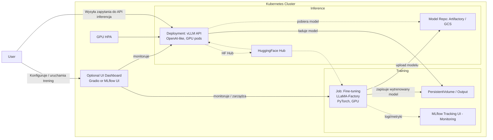
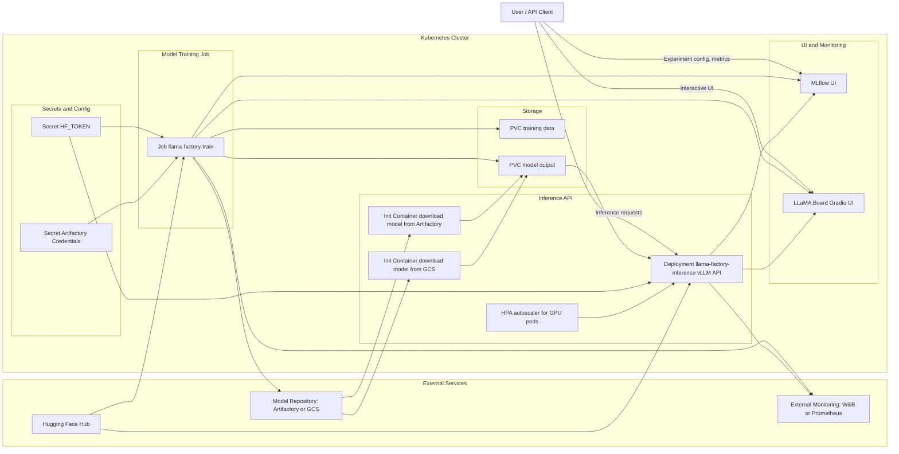
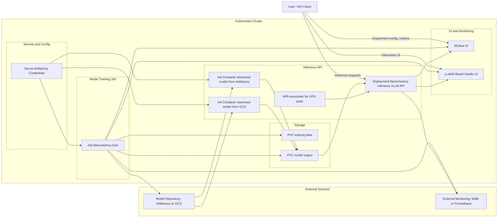

# Obrazy Docker i konfiguracja Kubernetes dla LLaMA-Factory

Dokument opisuje kompletną infrastrukturę dla **LLaMA-Factory**:

* trening (fine-tuning) na GPU,
* serwer inferencyjny API z **vLLM**,
* opcjonalny serwis UI (np. MLflow),
* konfigurację **Kubernetes**: Job/Deployment, autoskalowanie, Secret/ConfigMap, storage,
* mechanizm **dynamicznego ładowania modeli** z różnych źródeł,
* diagram architektury (Mermaid).

Całość oparta jest na wspólnym środowisku **Debian 12 + Python 3.11.2**, zgodnym z wymaganiami Hugging Face Transformers, vLLM oraz PyTorch (oficjalny obraz LLaMA-Factory również używa Pythona 3.11 i PyTorch 2.6.0).

---

## 1. Dockerfile dla treningu LLaMA-Factory (GPU)

Ten obraz służy do **treningu modeli** za pomocą LLaMA-Factory na GPU. Bazuje na Debianie 12 i instaluje Pythona 3.11.2 oraz wszystkie zależności z `apt`/`pip`, bez używania gotowych baz CUDA/PyTorch (instalujemy je ręcznie).

Zawiera m.in.:

* **PyTorch z obsługą CUDA**,
* bibliotekę **Transformers**,
* samą platformę **LLaMA-Factory**,
* opcjonalnie: **bitsandbytes**, **DeepSpeed**, **FlashAttention**.

```dockerfile
# Podstawa: Debian 12 (Bookworm) + Python 3.11.2
FROM debian:12 AS base

ENV DEBIAN_FRONTEND=noninteractive

# Instalacja Pythona 3.11 (Debian 12 domyślnie zawiera Python 3.11.2) oraz pip i zależności budowania
RUN apt-get update && apt-get install -y \
    python3.11 python3.11-venv python3-pip \
    build-essential git curl wget \
    && apt-get clean && rm -rf /var/lib/apt/lists/*

# Ustawienie aliasów, żeby 'python' i 'pip' wskazywały na Python 3.11
RUN ln -s /usr/bin/python3.11 /usr/bin/python && ln -s /usr/bin/pip3 /usr/bin/pip

# Instalacja zależności Pythona wymaganych do trenowania LLM
# (PyTorch z obsługą CUDA, Transformers, Datasets, itp.)
RUN pip install --no-cache-dir --upgrade pip && \
    pip install --no-cache-dir torch torchvision torchaudio --extra-index-url https://download.pytorch.org/whl/cu118 && \
    pip install --no-cache-dir transformers==4.33.0 datasets==2.14.0

# Instalacja LLaMA-Factory z PyPI wraz z rozszerzeniami:
# - 'torch' aby doinstalować ewentualnie odpowiednią wersję torch (już zainstalowaliśmy, więc to pominie)
# - 'metrics' jeśli chcemy metryki HuggingFace
RUN pip install --no-cache-dir llamafactory[torch,metrics]==0.9.3

# (Opcjonalnie) Instalacja dodatkowych pakietów:
# bitsandbytes (8-bit trening), deepspeed (opcjonalne przy multi-GPU), flash-attn (wymaga kompilacji)
# RUN pip install --no-cache-dir bitsandbytes==0.41.1 deepspeed==0.9.6
# FlashAttention wymaga nagłówków CUDA i kompilacji - instalacja tylko jeśli potrzebna:
# RUN apt-get update && apt-get install -y cuda-toolkit && \
#     pip install flash-attn==2.7.4 && \
#     apt-get remove -y cuda-toolkit && apt-get autoremove -y

# Ustawienie katalogu roboczego i ewentualne skopiowanie kodu/konfiguracji
WORKDIR /app
# COPY ./train_config.yaml /app/config/train_config.yaml

# Domyślny punkt wejścia: uruchamiamy powłokę – komenda treningowa zostanie podana przez K8s (Job)
ENTRYPOINT ["/bin/bash"]
```

**Komentarz**

* PyTorch z CUDA instalowany jest z oficjalnego indexu (`cu118` – można dostosować).
* LLaMA-Factory instalowana jest z PyPI (`llamafactory==0.9.3`).
* Komenda treningowa (`llamafactory-cli train ...`) będzie przekazana z **Joba Kubernetes**.

---

## 2. Dockerfile dla serwisu inferencyjnego (vLLM, GPU)

Ten obraz definiuje serwer **inference API** z backendem vLLM, kompatybilny z OpenAI API.

```dockerfile
# Obraz bazowy może być ten sam co w treningu, aby wykorzystać cache
FROM debian:12

ENV DEBIAN_FRONTEND=noninteractive

# Podstawowe pakiety systemowe i Python 3.11
RUN apt-get update && apt-get install -y python3.11 python3-pip && \
    apt-get clean && rm -rf /var/lib/apt/lists/*
RUN ln -s /usr/bin/python3.11 /usr/bin/python && ln -s /usr/bin/pip3 /usr/bin/pip

# Instalacja wymaganych bibliotek Python: PyTorch (GPU), Transformers, vLLM, LLaMA-Factory
RUN pip install --no-cache-dir --upgrade pip && \
    pip install --no-cache-dir torch torchvision --extra-index-url https://download.pytorch.org/whl/cu118 && \
    pip install --no-cache-dir transformers==4.33.0 vllm==0.1.5 llamafactory[torch]==0.9.3

WORKDIR /app
# COPY ./inference_config.yaml /app/config/inference.yaml

# Ustawienie domyślnej komendy uruchamiającej serwer API na porcie 8000 z użyciem vLLM.
CMD ["llamafactory-cli", "api", "/app/config/inference.yaml", "infer_backend=vllm", "API_PORT=8000"]
```

**Komentarz**

* Serwer uruchamiany przez `llamafactory-cli api ...` wystawia API **OpenAI-like** (np. `/v1/completions`).
* Konfiguracja `/app/config/inference.yaml` określa m.in. `model_name_or_path`, parametry vLLM i API.

---

## 3. Dockerfile dla serwisu UI (opcjonalny dashboard)

Przykładowy lekki serwis **MLflow** pełniący funkcję panelu monitorowania treningów i wersjonowania modeli.

```dockerfile
FROM debian:12

RUN apt-get update && apt-get install -y python3.11 python3-pip && \
    apt-get clean && rm -rf /var/lib/apt/lists/*
RUN ln -s /usr/bin/python3.11 /usr/bin/python && ln -s /usr/bin/pip3 /usr/bin/pip

# Instalacja MLflow i potrzebnych zależności (np. gunicorn, jeśli chcemy używać go jako serwer WSGI)
RUN pip install --no-cache-dir mlflow[sqlalchemy]==2.6.0 psycopg2-binary

WORKDIR /app

# Port 5000 to domyślny port interfejsu MLflow
EXPOSE 5000

# Uruchomienie serwera MLflow (tracking UI) słuchającego na wszystkich interfejsach
CMD ["mlflow", "server", "--host", "0.0.0.0", "--port", "5000"]
```

**Alternatywa:** użycie wbudowanego **LLaMA Board (Gradio)** poprzez obraz rozszerzający obraz treningowy i komendę `llamafactory-cli webui`.

---

## 4. Konfiguracja Kubernetes

### 4.1. Job Kubernetes dla treningu LLaMA-Factory

Job służy do uruchomienia jednorazowego procesu treningowego, z obsługą **GPU**, wolumenów oraz sekretów.

```yaml
apiVersion: batch/v1
kind: Job
metadata:
  name: llama-factory-train
spec:
  backoffLimit: 1                   # w razie błędu ponów maksymalnie raz
  template:
    spec:
      restartPolicy: OnFailure
      containers:
      - name: training
        image: myregistry/llama-factory-train:latest
        imagePullPolicy: IfNotPresent
        args: ["llamafactory-cli", "train", "/app/config/train_config.yaml"]  # uruchomienie treningu
        env:
        - name: HF_TOKEN                  # Hugging Face token dla prywatnych modeli
          valueFrom:
            secretKeyRef:
              name: hf-secret
              key: HF_TOKEN
        - name: ARTIFACTORY_URL           # URL instancji Artifactory (repozytorium modeli)
          valueFrom:
            secretKeyRef:
              name: artifactory-secret
              key: ARTIFACTORY_URL
        - name: ARTIFACTORY_USERNAME      # Poświadczenia Artifactory (jeśli wymagane do upload)
          valueFrom:
            secretKeyRef:
              name: artifactory-secret
              key: ARTIFACTORY_USERNAME
        - name: ARTIFACTORY_PASSWORD
          valueFrom:
            secretKeyRef:
              name: artifactory-secret
              key: ARTIFACTORY_PASSWORD
        resources:
          limits:
            nvidia.com/gpu: 1            # przydzielenie 1 GPU do podu treningowego
          requests:
            nvidia.com/gpu: 1
        volumeMounts:
        - name: train-data
          mountPath: /app/data           # (opcjonalnie) dataset do treningu
        - name: train-output
          mountPath: /app/output         # (opcjonalnie) miejsce zapisu wynikowego modelu
      volumes:
      - name: train-data
        persistentVolumeClaim:
          claimName: training-data-pvc   # PVC z danymi treningowymi (jeśli używamy)
      - name: train-output
        persistentVolumeClaim:
          claimName: model-output-pvc    # PVC na wyniki (model) - do odbioru lub współdzielenia z inferencją
```

---

### 4.2. Deployment Kubernetes dla inference API + HPA

Deployment serwujący model przez API na GPU, z **HorizontalPodAutoscaler**.

```yaml
apiVersion: apps/v1
kind: Deployment
metadata:
  name: llama-factory-inference
spec:
  replicas: 1
  selector:
    matchLabels:
      app: llama-infer
  template:
    metadata:
      labels:
        app: llama-infer
    spec:
      containers:
      - name: inference
        image: myregistry/llama-factory-infer:latest
        imagePullPolicy: IfNotPresent
        ports:
        - containerPort: 8000                      # port API (OpenAI-style)
        env:
        - name: HF_TOKEN
          valueFrom:
            secretKeyRef:
              name: hf-secret
              key: HF_TOKEN
        - name: MODEL_PATH                         # przykład: przekazanie ścieżki lub nazwy modelu
          value: "/models/Meta-Llama-3-8B"         # (jeśli model montowany lokalnie)
        resources:
          limits:
            nvidia.com/gpu: 1                     # każda replika używa 1 GPU
          requests:
            nvidia.com/gpu: 1
        volumeMounts:
        - name: model-storage
          mountPath: /models                      # montujemy wolumen z plikami modelu
      volumes:
      - name: model-storage
        persistentVolumeClaim:
          claimName: model-output-pvc             # PVC zawierający wytrenowany model (lub dynamicznie załadowany)
---
apiVersion: autoscaling/v2
kind: HorizontalPodAutoscaler
metadata:
  name: llama-inference-hpa
spec:
  scaleTargetRef:
    apiVersion: apps/v1
    kind: Deployment
    name: llama-factory-inference
  minReplicas: 1
  maxReplicas: 4
  metrics:
  - type: Resource
    resource:
      name: cpu
      targetAverageUtilization: 50
```

---

### 4.3. Secrets (Hugging Face, Artifactory)

Przekazywanie wrażliwych danych jako **Secret**.

```yaml
apiVersion: v1
kind: Secret
metadata:
  name: hf-secret
type: Opaque
stringData:
  HF_TOKEN: "hf_xxxxxxx"   # tutaj wstaw swój HuggingFace User Access Token
---
apiVersion: v1
kind: Secret
metadata:
  name: artifactory-secret
type: Opaque
stringData:
  ARTIFACTORY_URL: "https://artifactory.example.com/models"   # URL repozytorium modeli/artefaktów
  ARTIFACTORY_USERNAME: "myuser"
  ARTIFACTORY_PASSWORD: "mypassword"
```

---

### 4.4. PersistentVolume i PersistentVolumeClaim dla modeli

Przykład prostego **PV opartego o hostPath** oraz powiązanego PVC.

```yaml
apiVersion: v1
kind: PersistentVolume
metadata:
  name: llama-model-pv
spec:
  capacity:
    storage: 50Gi
  accessModes:
  - ReadWriteOnce
  hostPath:
    path: /mnt/llamafactory/models   # ścieżka na węźle, gdzie pliki modelu będą przechowywane
  nodeAffinity:
    required:
      nodeSelectorTerms:
      - matchExpressions:
        - key: kubernetes.io/hostname   # PV przypięty do konkretnego węzła (nazwa węzła1)
          operator: In
          values:
          - gpu-node-1
---
apiVersion: v1
kind: PersistentVolumeClaim
metadata:
  name: model-output-pvc
spec:
  accessModes:
  - ReadWriteOnce
  resources:
    requests:
      storage: 50Gi
  volumeName: llama-model-pv
```

---

## 5. Dynamiczne ładowanie modeli i integracja z vLLM

Celem jest rozdzielenie:

* **obrazu kontenera** (kod, biblioteki),
* **wag modelu** (pliki modeli na storage).

Dzięki temu:

* ten sam obraz może ładować różne modele,
* modele mogą być przechowywane w GCS, Artifactory, na PVC, itp.

### 5.1. Hugging Face Hub

* `model_name_or_path` w konfiguracji wskazuje identyfikator HF, np.
  `meta-llama/Meta-Llama-3-8B-Instruct`.
* Pobieranie modeli odbywa się automatycznie przy starcie podu.
* Dostęp do prywatnych/gated modeli przez zmienną środowiskową **`HF_TOKEN`**.
* Zalecane:

  * montowanie wolumenu do `~/.cache/huggingface`,
  * albo wcześniejsze pobranie i reużywanie lokalnych plików.

### 5.2. Lokalny wolumen (PVC)

* Trening zapisuje model do `model-output-pvc`.
* Ten sam wolumen montujemy do podów inferencyjnych pod `/models/...`.
* W konfiguracji vLLM ustawiamy `model_name_or_path: "/models/<folder-z-modelem>"`.
* vLLM ładuje model z lokalnego filesystemu.

### 5.3. Google Cloud Storage (GCS)

Dwa typowe podejścia:

1. **GCS Fuse / CSI** – bucket montowany bezpośrednio jako wolumen w podzie (np. `/models/modelX`).
2. **Init Container** pobierający model z GCS do wspólnego wolumenu:

```yaml
initContainers:
- name: download-model
  image: google/cloud-sdk:latest    # zawiera gsutil
  env:
  - name: GOOGLE_APPLICATION_CREDENTIALS
    value: /var/secrets/gcp/key.json   # referencja do klucza service account (secret)
  args:
  - /bin/bash
  - -c
  - |
    gsutil cp gs://my-bucket/models/model.bin /models/ && \
    gsutil cp gs://my-bucket/models/*tokenizer* /models/ && \
    gsutil cp gs://my-bucket/models/config.json /models/
  volumeMounts:
  - name: model-storage
    mountPath: /models
  - name: gcp-cred
    mountPath: /var/secrets/gcp
```

### 5.4. Artifactory

Podobnie jak GCS, wykorzystujemy **init-container** do pobrania modelu:

```yaml
initContainers:
- name: download-model
  image: curlimages/curl:latest
  env:
  - name: ARTIFACTORY_USER
    valueFrom: 
      secretKeyRef:
        name: artifactory-secret
        key: ARTIFACTORY_USERNAME
  - name: ARTIFACTORY_PASS
    valueFrom:
      secretKeyRef:
        name: artifactory-secret
        key: ARTIFACTORY_PASSWORD
  - name: ARTIFACTORY_URL
    valueFrom:
      secretKeyRef:
        name: artifactory-secret
        key: ARTIFACTORY_URL
  args:
  - /bin/sh
  - -c
  - |
    echo "Downloading model from Artifactory...";
    curl -u $ARTIFACTORY_USER:$ARTIFACTORY_PASS -O $ARTIFACTORY_URL/model.zip && \
    unzip model.zip -d /models;
  volumeMounts:
  - name: model-storage
    mountPath: /models
```

### 5.5. Zachowanie vLLM

* **vLLM** ładuje model przy starcie serwera (`llamafactory-cli api ... infer_backend=vllm`).
* Jeden pod zazwyczaj obsługuje **jeden model**.
* Przełączanie modelu = zwykle uruchomienie nowego podu (nowy Deployment / inny config).
* Możliwe jest posiadanie wielu Deploymentów, np.:

  * `llama-factory-inference-modelA`,
  * `llama-factory-inference-modelB`.

---

## 6. Monitoring i UI

### 6.1. Trening

* LLaMA-Factory potrafi wysyłać metryki do **Weights & Biases (W&B)** (przez `report_to: wandb`).
* Możliwa integracja z **MLflow** (API trackingowe).
* Można dodać **sidecar** z eksporterem GPU (np. nvidia dcgm-exporter) dla metryk Prometheus.

### 6.2. Inference

* vLLM można opakować w aplikację (np. FastAPI) wystawiającą `/metrics` dla Prometheusa.
* Alternatywnie można użyć rozwiązań typu **KServe/Seldon** (bardziej rozbudowane, poza tym dokumentem).

### 6.3. Dashboard UI

* **MLflow UI** – centralny panel: eksperymenty, metryki, artefakty, rejestr modeli.
* Opcjonalnie: **LLaMA Board (Gradio)** – interaktywne korzystanie z modelu i konfiguracja treningów.

---

## 7. Diagram architektury (Mermaid)



**Legenda**

* Prostokąty – pody/serwisy w klastrze K8s.
* Cylindry – wolumeny (PV/PVC).
* Komponenty zewnętrzne – Hugging Face Hub, Artifactory/GCS.
* Strzałki – przepływy danych (modele, metryki, żądania API).





