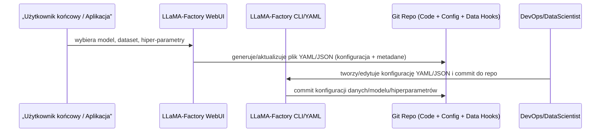
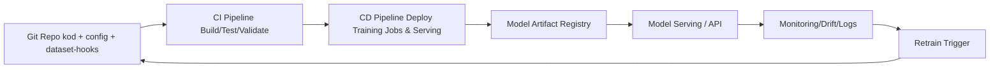
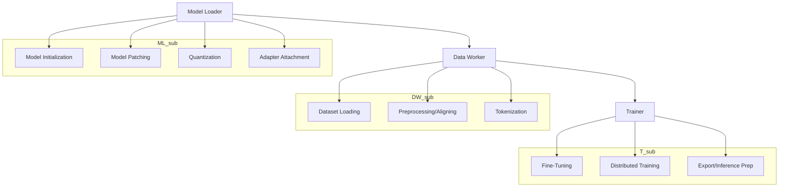
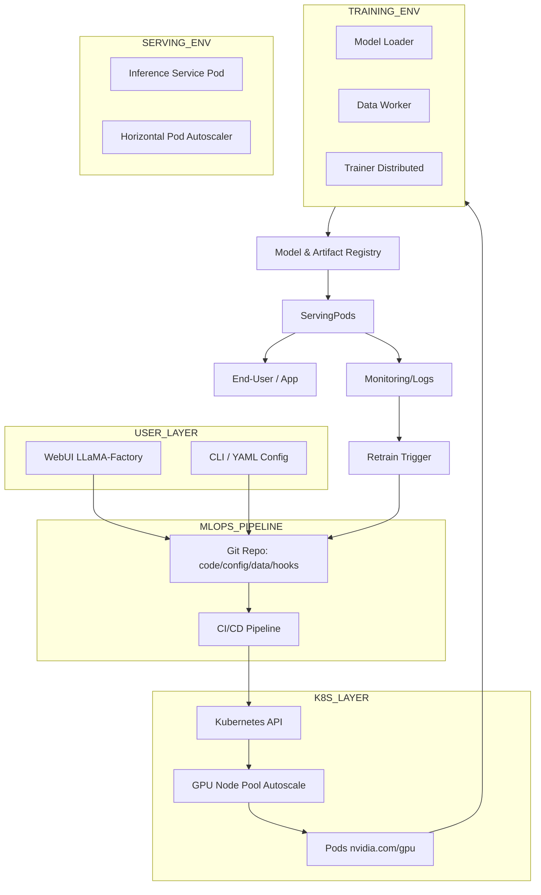
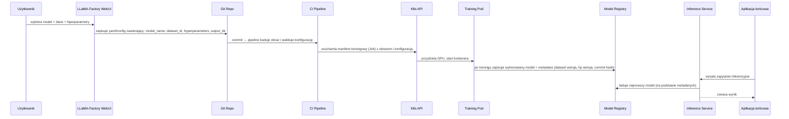

Poniżej znajdziesz **pełny dokument w formacie Markdown**, który integruje wszystkie elementy: od użytkownika końcowego, przez warstwę GUI/CLI LLaMA‑Factory, repozytorium kodu/konfiguracji, CI/CD/MLOps, aż po architekturę Kubernetes z multi-GPU. Dodatkowo **zawiera szczegółowe diagramy Mermaid**, które ukazują m.in. zapis modeli, danych i hiperparametrów z WebUI lub YAML do repozytorium, oraz ich przepływ w systemie.

---

# Architektura „end-to-end” z LLaMA-Factory — pełna wersja

## 0. Wprowadzenie

Framework LLaMA-Factory dostarcza interfejs GUI (WebUI) oraz CLI/konfiguracje YAML/JSON, dzięki czemu użytkownicy mogą definiować modele, dane, hiperparametry i uruchamiać trening bez głębokiego kodowania. ([Llama Factory][1])
W kontekście produkcyjnym trzeba uwzględnić: wersjonowanie kodu, danych i konfiguracji (datasety + hiperparametry + modele) w repozytorium, pipeline CI/CD, środowisko Kubernetes z GPU i mechanizmy monitoringu i retrainingu.

---

## 1. Rola użytkownika, GUI/CLI i zapis konfiguracji do repo

**Opis**:

* Użytkownik przez WebUI wybiera m.in. bazowy model, metodę fine-tuningu (np. LoRA, QLoRA), dataset, hiperparametry.
* WebUI automatycznie generuje lub aktualizuje plik konfiguracji (`config.yaml` lub `train_config.json`).
* Plik ten, wraz z kodem, datasetami, metadanymi, jest zapisany w repozytorium Git – co umożliwia pełne śledzenie zmian (wersjonowanie modeli, hiperparametrów, danych).
* Alternatywnie lub równolegle: DevOps/DataScientist używa CLI lub ręcznie przygotowuje YAML/JSON, a potem commit-uje do repo.

---

## 2. Pipeline CI/CD + MLOps z uwzględnieniem wersjonowania konfiguracji modeli, danych i hiperparametrów

**Opis**:

* Git repo zawiera: kod LLaMA-Factory, pliki YAML/JSON konfiguracji (hiperparametry, datasety, modele), hooki do danych (dataset_info.json itp.). ([datacamp.com][2])
* CI pipeline: buduje obrazy Docker, wykonuje testy integracyjne/config validation (czy plik YAML jest poprawny, czy metadane datasetu istnieją).
* CD pipeline: na podstawie konfiguracji deployuje joby treningowe lub serwisy inferencyjne. Artefakty (wytrenowane modele, adaptery LoRA) trafiają do rejestru modeli.
* Model Serving udostępnia model jako API. Monitoring obserwuje metryki, drift danych, wydajność. Gdy wykryty jest retraining trigger lub nowa wersja konfiguracji/danych, cykl rozpoczyna się na nowo.

---

## 3. Wewnętrzna struktura LLaMA-Factory z mapowaniem komponentów

**Opis**:

* Model Loader: ładuje pre-trained model, stosuje adaptery/LoRA, kwantyzację.
* Data Worker: przygotowuje dane (ładowanie, przetwarzanie, tokenizacja).
* Trainer: wykonuje fine-tuningu (metoda, hiperparametry), w wersji rozproszonej (multi-GPU/multi-node), następnie eksportuje model gotowy do serwisu.
* W ramach CI/CD/MLOps warianty tej struktury są wersjonowane – konfiguracje hiperparametrów czy datasetów są zapisane jako artefakty w repo.

---

## 4. Architektura Kubernetes + multi-GPU + LLaMA-Factory + wersjonowanie konfiguracji

**Opis warstw**:

* USER_LAYER: użytkownik końcowy lub analityk używa WebUI lub CLI/YAML, generując konfiguracje.
* MLOPS_PIPELINE: repozytorium wersjonuje kod + konfigurację + dane; CI/CD pipeline automatyzuje budowę i wdrażanie.
* K8S_LAYER: klaster Kubernetes z GPU Node Pool, scheduler alokuje pody, które uruchamiają trening lub serwis inferencyjny.
* TRAINING_ENV: w podzie działa LLaMA-Factory (Model Loader, Data Worker, Trainer) i korzysta z multi-GPU/rozproszonego środowiska.
* SERVING_ENV: serwis inferencyjny, skalowany (HPA), udostępnia model dla użytkownika końcowego.
* Monitoring & retrain: cały cykl jest zamknięty — jeśli wykryty drift lub nowa wersja danych/konfiguracji, cykl restartuje się.

---

## 5. Przepływ danych, modeli i hiperparametrów — krok po kroku

**Opis**:

* W WebUI użytkownik definiuje wybór modelu, danych oraz hiperparametrów i „kliknięciem” inicjuje generowanie konfiguracji YAML/JSON.
* Konfiguracja + kod + dataset hook są commitowane do Git – co umożliwia pełną śledzalność: która wersja hiperparametrów, datasetu i kodu została użyta do treningu.
* CI/pipeline automatycznie buduje obraz i weryfikuje plik konfiguracji (np. czy wszystkie wymagane pola są ustawione).
* Kubernetes uruchamia job treningu z konfiguracją zawartą w pliku YAML – często razem z metadanymi commit-hash, wersją datasetu, wersją hiperparametrów.
* Po treningu artefakt modelu (np. adaptery LoRA, końcowy model) zapisywany jest w Model Registry wraz z metadanymi (dataset id, hp id, commit hash).
* Serwis inferencyjny ładuje właściwy model (na podstawie metadanych) i udostępnia go dla aplikacji końcowej.
* Dzięki temu możliwe jest odtworzenie każdej wersji modelu: znając commit, dataset, hiperparametry, model można zrekonstruować.

---

## 6. Dokumentacja obrazów, wersjonowania modeli i danych

* Plik YAML/JSON wygenerowany przez WebUI zawiera pola takie jak: `model_name_or_path`, `dataset`, `finetuning_type`, `learning_rate`, `num_train_epochs`, `output_dir` itd. ([Medium][3])
* Ten plik jest commitowany do repo → wersjonowany.
* Dane treningowe: dataset_info.json lub inne pliki metadanych są też wersjonowane w repo. ([datacamp.com][2])
* Po zakończeniu treningu model zapisuje się w rejestrze razem z: config id (commit hash), dataset version, hp version.
* Dzięki temu traceability (śledzalność) hiperparametrów + danych + kodu jest zachowana — kluczowe w MLOps.

---

## 7. Podsumowanie i zalecenia

* Zadbaj o **repozytorium jednoźródłowe** dla kodu, konfiguracji (hiperparametry), datasetów/metadanych.
* Używaj WebUI LLaMA-Factory jako warstwy wejściowej (użytkownik końcowy lub analityk) — ale generuj konfigurację, która trafia do repo.
* Włącz CI/CD: każdy commit konfiguracji/hiperparametrów/danych powinien wyzwalać pipeline.
* Na Kubernetes: trening i serwis wdrażane poprzez manifesty zawierające obraz + konfigurację + metadane.
* Każdy model wytrenowany niech ma zapisane metadane: commit hash, dataset id/ver, hp id/ver → pozwala na odtworzenie eksperymentu.
* Serwis inferencyjny może automatycznie ładować najnowszy model lub wersję wybraną na podstawie metadanych.
* Monitoring + retrain loop: jeśli wykryty drift danych lub nowe konfiguracje → cykl zaczyna się od nowa.
* Stosując tę architekturę masz: **end-user friendly WebUI**, **pełne wersjonowanie danych+hiperparametrów+modeli**, **skalowalną infrastrukturę multi-GPU w Kubernetes**, oraz **ciągły przepływ pracy MLOps/CI/CD**.

---

Jeśli chcesz, mogę przygotować **plik Markdown gotowy do repo** zawierający wszystko powyższe oraz automatycznie wygenerowany **szablon konfiguracji YAML/JSON** dla WebUI → repo (z metadanymi wersjonowania) oraz manifesty Kubernetes (TrainingJob + ServingDeployment) z adnotacjami dotyczącymi metadanych. Chcesz to?

[1]: https://llamafactory.readthedocs.io/en/latest/?utm_source=chatgpt.com "Welcome to LLaMA Factory!"
[2]: https://www.datacamp.com/tutorial/llama-factory-web-ui-guide-fine-tuning-llms?utm_source=chatgpt.com "LlaMA-Factory WebUI Beginner's Guide: Fine-Tuning LLMs"
[3]: https://hossboll.medium.com/how-to-actually-fine-tune-an-llm-using-llama-factory-021dc6db6909?utm_source=chatgpt.com "How to actually fine-tune an LLM using LLaMA-Factory"
