# Architektura platformy LLM Fine-tuning

## 1. Wprowadzenie

Dokument opisuje architekturę platformy do fine-tuningu i serwowania modeli LLM w środowisku korporacyjnym. Platforma wykorzystuje LLaMA-Factory do treningu, vLLM do inferencji oraz MLFlow jako rejestr modeli i narzędzie do experiment tracking.

---

## 2. Założenia i polityki organizacji

### 2.1. Infrastruktura

| Komponent | Wartość |
|-----------|---------|
| **Platforma** | Google Kubernetes Engine (GKE) |
| **Region** | EU (Holandia) |
| **GPU** | NVIDIA A100 (zalecane) |
| **System bazowy** | Debian 12 |
| **Python** | 3.11 |

### 2.2. Polityki bezpieczeństwa

| Polityka | Realizacja |
|----------|------------|
| **Autoryzacja** | Workload Identity (GCP) |
| **Ruch sieciowy** | Przez Gateway (brak bezpośredniego dostępu do modeli) |
| **Izolacja** | Namespace per workspace |
| **Logowanie** | Gateway loguje requesty/responsy |
| **Guardrails** | Gateway filtruje treści |

### 2.3. Multitenancy

Platforma wspiera model **workspace'ów** - logicznych jednostek między projektem a zespołem:

- Każdy workspace = osobny namespace w K8s
- Dedykowana instancja MLFlow per workspace
- Możliwość wygaszania/usuwania nieaktywnych workspace'ów
- Wspólne zasoby (Gateway, modele bazowe) w namespace `llm-shared`

---

## 3. Komponenty systemu

### 3.1. Mapa komponentów

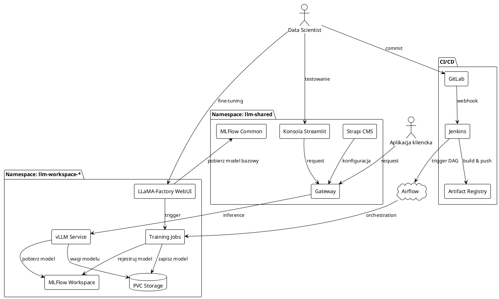

### 3.2. Opis komponentów

#### Warstwa CI/CD

| Komponent | Rola | Technologia |
|-----------|------|-------------|
| **GitLab** | Repozytorium kodu, konfiguracji YAML, Dockerfile'ów | GitLab CE/EE |
| **Jenkins** | Pipeline'y CI/CD, budowanie obrazów, triggerowanie Airflow | Jenkins |
| **Artifact Registry** | Przechowywanie obrazów Docker | GCP Artifact Registry |
| **Airflow** | Orkiestracja workflow'ów treningowych | Apache Airflow |

#### Warstwa wspólna (llm-shared)

| Komponent | Rola | Technologia |
|-----------|------|-------------|
| **Gateway** | Routing, autoryzacja, guardrails, logowanie | Custom (wewnętrzny) |
| **Strapi** | CMS do konfiguracji Gateway'a (modele, limity, uprawnienia) | Strapi |
| **Konsola Streamlit** | UI do testowania promptów, porównywania modeli | Streamlit |
| **MLFlow Common** | Rejestr modeli bazowych (Llama-3, Mistral, etc.) | MLFlow |

#### Warstwa workspace'u (llm-workspace-*)

| Komponent | Rola | Technologia |
|-----------|------|-------------|
| **LLaMA-Factory WebUI** | UI do fine-tuningu, konfiguracji, monitoringu | LLaMA-Factory |
| **MLFlow Workspace** | Experiment tracking, rejestr wytrenowanych modeli | MLFlow |
| **vLLM Service** | Serwowanie modeli (OpenAI-compatible API) | vLLM |
| **Training Jobs** | Joby treningowe na GPU | Kubernetes Jobs |
| **PVC Storage** | Przechowywanie wag modeli, checkpointów | GKE Persistent Volume |

---

## 4. Narzędzia użytkownika

### 4.1. LLaMA-Factory WebUI

**Przeznaczenie:** Fine-tuning modeli LLM

**Funkcjonalności:**
- Wybór modelu bazowego z MLFlow Common
- Konfiguracja parametrów treningu (LoRA, QLoRA, full fine-tuning)
- Wybór datasetu (lokalne, Hugging Face mirror)
- Monitoring postępu treningu w czasie rzeczywistym
- Eksport konfiguracji do YAML
- Integracja z MLFlow (experiment tracking)

**Ograniczenia:**
- Jedna instancja per workspace (brak natywnego multitenancy)
- Równoległe sesje otrzymują osobne ID zadań

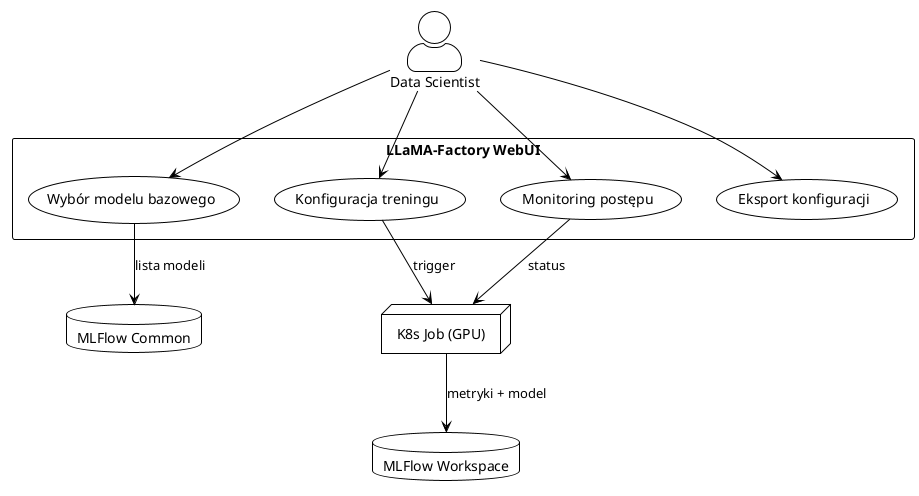

### 4.2. Konsola Streamlit

**Przeznaczenie:** Testowanie i ewaluacja wytrenowanych modeli

**Funkcjonalności:**
- Lista wszystkich modeli dostępnych przez Gateway
- Testowanie promptów
- Porównywanie odpowiedzi side-by-side
- Historia konwersacji
- Metryki (latency, tokens/s)

**Integracja:**
- Pobiera listę modeli z Strapi
- Komunikuje się z modelami przez Gateway (z autoryzacją)

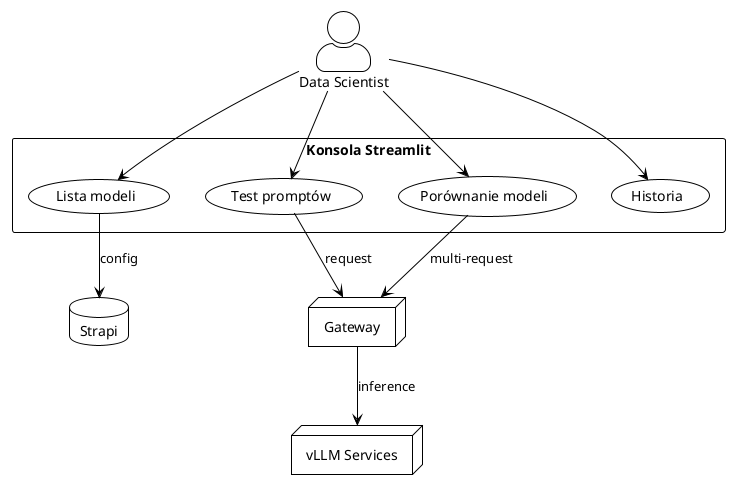

### 4.3. Porównanie narzędzi UI

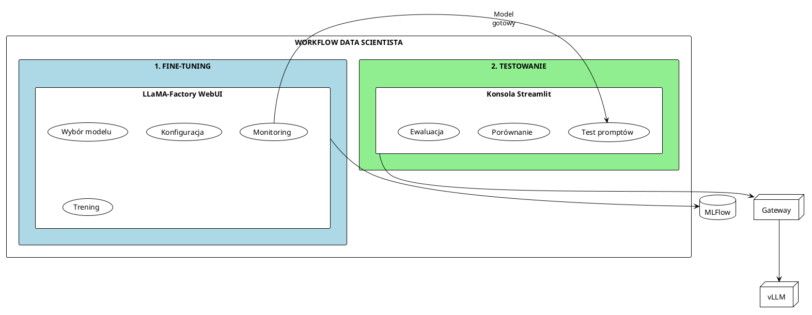

---

## 5. Przepływy danych

### 5.1. Flow: Fine-tuning przez WebUI

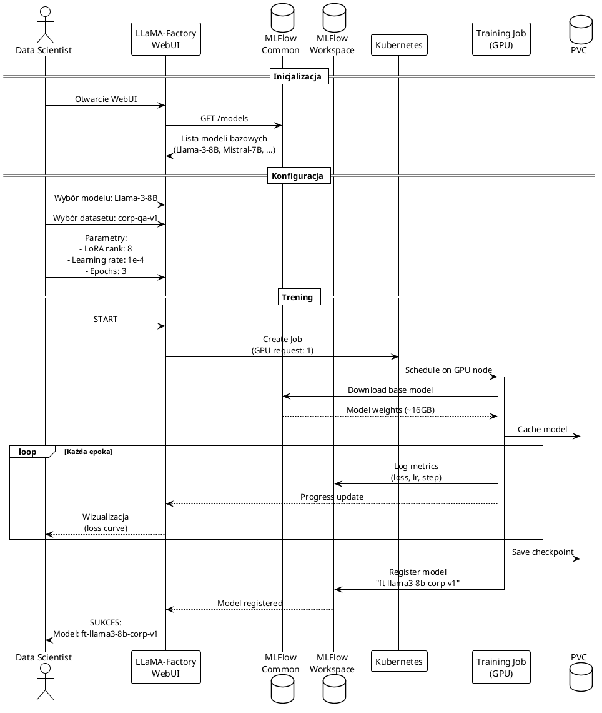

### 5.2. Flow: Testowanie przez Streamlit

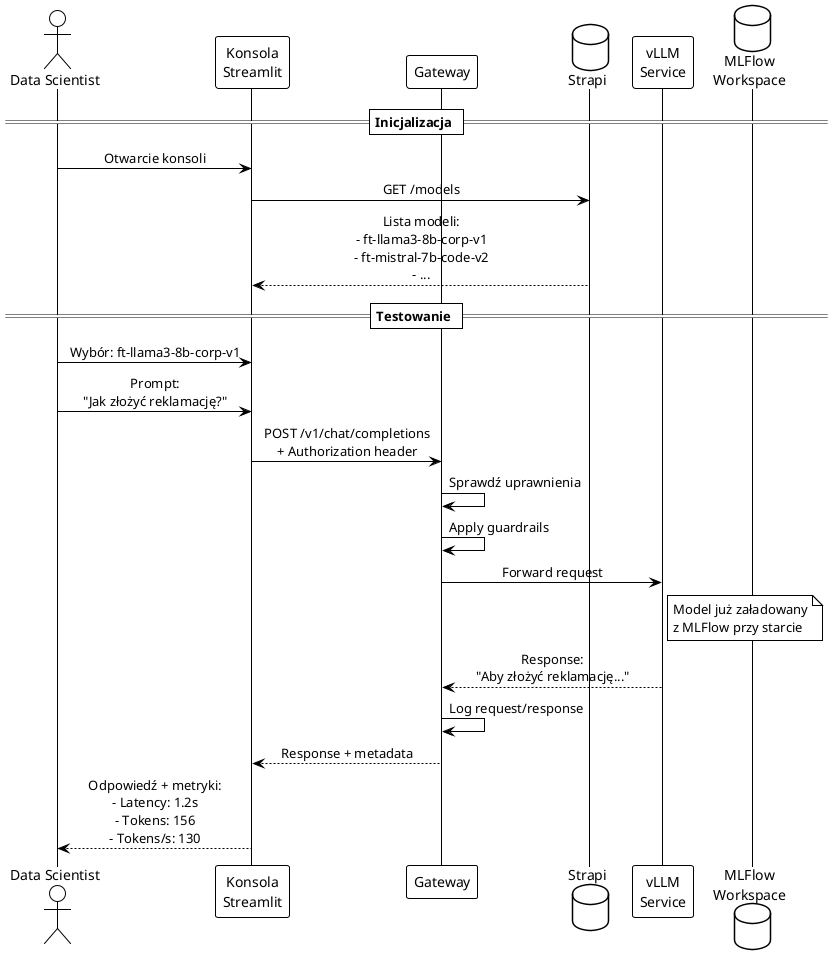

### 5.3. Flow: CI/CD (Jenkins + Airflow)

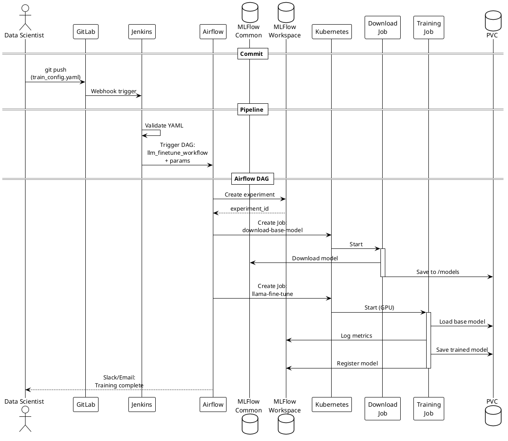

---

## 6. Architektura sieciowa

### 6.1. Diagram sieci

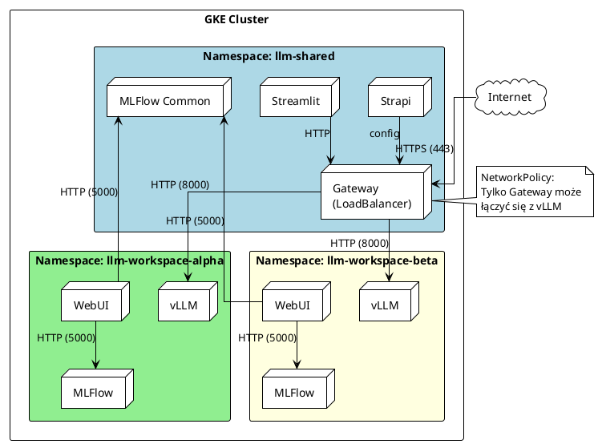

### 6.2. NetworkPolicy

Ruch do serwisów vLLM jest ograniczony tylko do Gateway'a:

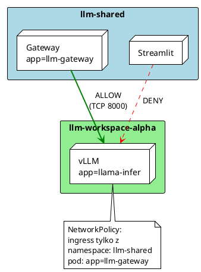

---

## 7. Model danych MLFlow

### 7.1. Struktura rejestrów

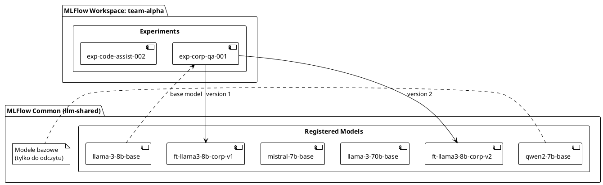

### 7.2. Cykl życia modelu

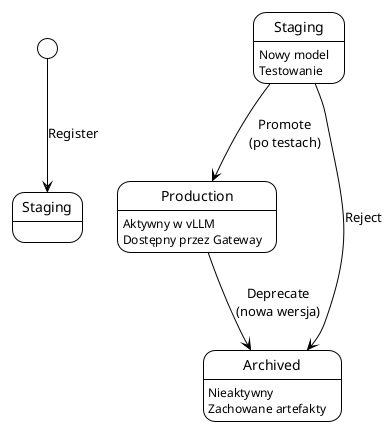

---

## 8. Macierz odpowiedzialności (RACI)

| Działanie | Data Scientist | MLOps | Platform Team |
|-----------|:-------------:|:-----:|:-------------:|
| Konfiguracja treningu | **R** | C | I |
| Uruchomienie treningu | **R** | I | I |
| Monitoring treningu | **R** | C | I |
| Promocja modelu do prod | A | **R** | C |
| Konfiguracja Gateway | I | **R** | C |
| Zarządzanie workspace'ami | I | **R** | A |
| Infrastruktura K8s | I | C | **R** |

**R** = Responsible, **A** = Accountable, **C** = Consulted, **I** = Informed

---

## 9. Wymagania techniczne

### 9.1. Wymagania GPU

| Typ treningu | Min. GPU | Zalecane GPU | VRAM |
|--------------|----------|--------------|------|
| LoRA 7B | 1x A100 | 1x A100 | 40GB |
| LoRA 13B | 1x A100 | 2x A100 | 80GB |
| Full fine-tune 7B | 4x A100 | 8x A100 | 320GB |
| Inference 7B | 1x A100 | 1x A100 | 16GB |

### 9.2. Storage

| Zasób | Rozmiar | Typ |
|-------|---------|-----|
| Model bazowy 7B | ~14GB | SSD (premium-rwo) |
| Model bazowy 70B | ~140GB | SSD (premium-rwo) |
| Checkpointy (per training) | ~20-50GB | SSD |
| MLFlow artifacts | ~100GB/workspace | Standard |

### 9.3. Wersje oprogramowania

| Komponent | Wersja |
|-----------|--------|
| LLaMA-Factory | 0.9.3 |
| vLLM | 0.4.0 |
| MLFlow | 2.10.0 |
| PyTorch | 2.2.0 |
| CUDA | 11.8 |
| Transformers | 4.37.0 |

---

## 10. Słownik pojęć

| Termin | Definicja |
|--------|-----------|
| **Workspace** | Izolowane środowisko (namespace) dla zespołu/projektu |
| **Gateway** | Centralny punkt dostępu do modeli z autoryzacją i logowaniem |
| **Fine-tuning** | Dostosowanie modelu bazowego do specyficznego zadania |
| **LoRA** | Low-Rank Adaptation - efektywna metoda fine-tuningu |
| **Experiment tracking** | Śledzenie metryk, parametrów i artefaktów treningu |
| **Model Registry** | Rejestr wersjonowanych modeli w MLFlow |
| **Guardrails** | Mechanizmy filtrowania niebezpiecznych treści |
| **Workload Identity** | Mechanizm GCP mapujący konta K8s na konta GCP |
